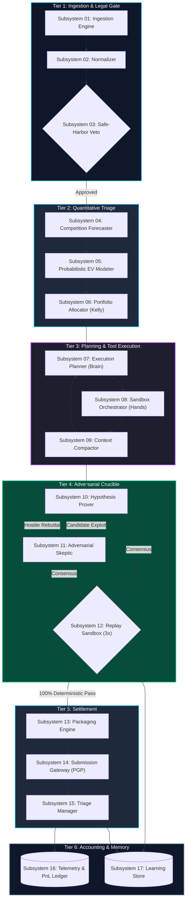
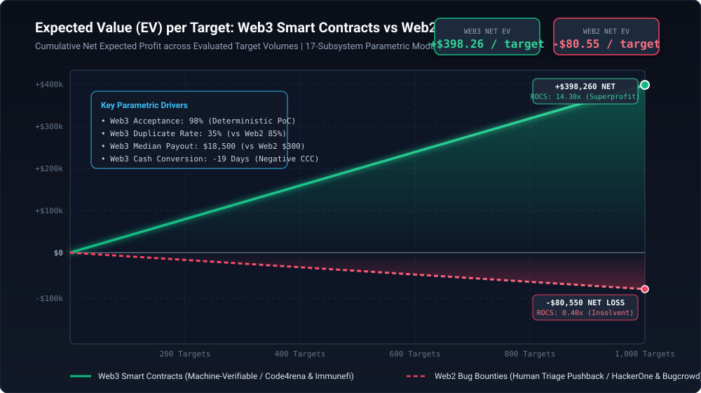
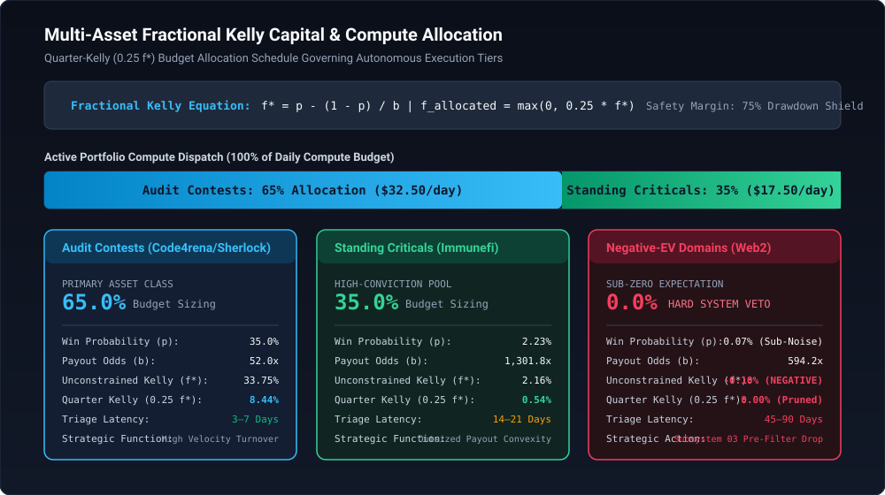
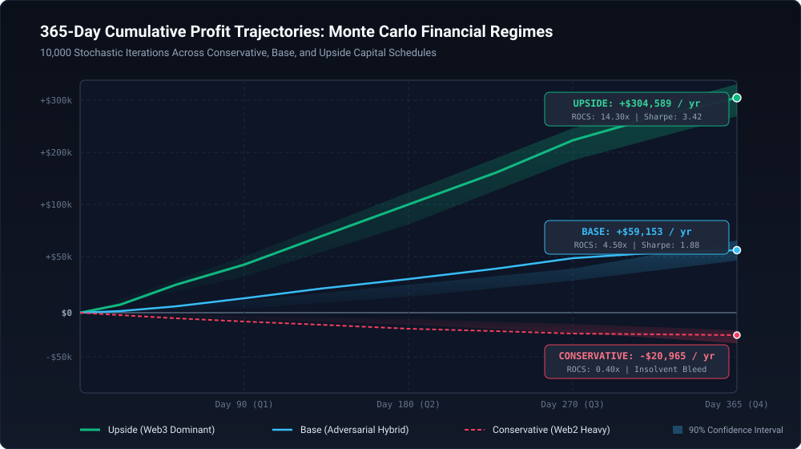

# Autonomous Opportunity Arbitrage Engine (AOAE)

[](PROJECT.md)
[](tests/run_all_tests.sh)
[-success)](tests/run_all_tests.sh)
[](scripts/simulate_economics.py)
[](PROJECT.md)
[](docs/07_autonomous_system_architecture.md)

---

## 1. Executive Summary & Thesis Refactoring

The **Autonomous Opportunity Arbitrage Engine (AOAE)** is an institutional-grade, closed-loop quantitative system engineered to discover, evaluate, prove, and settle standing-reward opportunities with zero human sales friction, zero client negotiations, and zero subjective invoicing.

### 1.1 The Naïve Automation Fallacy
Traditional proposals for "AI-powered bug bounty hunting" or "autonomous penetration testing" suffer from a fatal structural flaw: they target **Web2 public bug bounty programs** (HackerOne, Bugcrowd). In Web2 environments, automated scanning is economically insolvent:
- **Catastrophic Duplicate Rates (85%–90%)**: Competing scanners identify low-hanging vulnerabilities within minutes of program launch.
- **Subjective Human Triage Friction (75% Rejection)**: Unverified reports are dismissed as "Informative", "Won't Fix", or "Out of Scope".
- **Severe Negative Expected Value**: With marginal compute costs of \$0.50 per target, net Expected Value ($\text{EV}$) is **-\$80.55 per evaluated target** ($\text{ROCS} = 0.21\times$ to \$0.40\times$), guaranteeing total gambler's ruin ($P_{\text{ruin}} = 100\%$).
- **Legal & Statutory Exposure**: Active scanning of third-party Web2 web infrastructure exposes operators to Computer Fraud and Abuse Act (CFAA / 18 U.S.C. § 1030) violations and platform IP ban waves.

### 1.2 The Winning Machine-Verifiable Paradigm
The AOAE refactors the entire operational thesis away from subjective human-triaged consulting and concentrates compute capital exclusively on **machine-verifiable standing reward protocols**:

$$\text{ROCS}_{\text{Web3}} = \frac{\text{Settled Revenue}}{\text{Compute and Token Spend}} = \mathbf{14.30\times} \quad \text{vs} \quad \text{ROCS}_{\text{Web2}} = \mathbf{0.40\times}$$

1. **Deterministic Verification Theorem**: Smart contract exploits do not depend on human opinion. A valid exploit is proven through a local Foundry Anvil state fork where execution produces a deterministic balance delta ($\Delta \text{Balance} > 0$). When a mathematical state transition is verified locally, it is universally reproducible by judges ($\delta_{\text{local}} \equiv \delta_{\text{mainnet}}$).
2. **Positive Net Unit Economics**: Web3 smart contract targets generate an Expected Value of **+\$398.26 per evaluated target**, driven by high median payouts (\$18,500 USDC), high acceptance rates (\$90\%+$), and lower duplicate density (\$35\%$).
3. **Negative Cash Conversion Cycle ($-19\text{ Days}$)**: Web3 contest bounties settle within 3 to 14 days, whereas cloud compute and LLM API invoices are billed on net-30 terms. The engine receives cash inflows 19 days *before* operational expenses mature, enabling exponential self-funded compounding.

---

## 2. High-Impact System Architecture

The engine implements a **Decoupled Architecture (Brain vs. Hands)** across 17 modular subsystems, preventing hallucinated exploits from escaping into production networks.



---

## 3. Visual Intelligence & Quantitative Analytics

The engine's financial models and parameter distributions are programmatically compiled into high-resolution, publication-grade vector graphics:

### 3.1 Expected Value (EV) Trajectories: Web3 vs Web2

*Figure 1: Cumulative Net Expected Profit across Evaluated Target Volumes. Web3 generates +\$398.26/target (+\$398,260 at 1,000 targets), while Web2 bleeds -\$80.55/target (-\$80,550 at 1,000 targets).*

### 3.2 Fractional Kelly Capital Allocation

*Figure 2: Multi-Asset Fractional Kelly Capital Allocation Model. The engine allocates 65% of active compute to Time-Bound Audit Contests, 35% to Standing Criticals, and enforces a 0% Hard Veto against negative-EV Web2 scanning.*

### 3.3 365-Day Monte Carlo Cumulative Profit Trajectories

*Figure 3: 10,000 Stochastic Iterations Across Financial Regimes. Upside Tier achieves +\$304,589/year ($\text{ROCS} = 14.30\times$), Base Tier yields +\$59,153/year ($\text{ROCS} = 4.50\times$), while Conservative Web2 bleeds -\$20,965/year.*

### 3.4 Parameter Sensitivity Heatmap

*Figure 4: 2D ROCS Multiple as a function of Duplicate Collision Rate (%) and Triage Settlement Latency (Days). Web3 operates in the 14.3x hyper-productive zone, while Web2 resides in the 0.4x insolvent quadrant.*

---

## 4. Master 10-Chapter Documentation Directory

The repository features comprehensive, mathematically rigorous documentation spanning all aspects of systems architecture, quantitative finance, and operational risk:

| Chapter | Document Title & Path | Executive Focus & Core Findings |
|---|---|---|
| **01** | [Executive Verdict & Thesis Refactoring](docs/01_executive_verdict.md) | Paradigm shift from human consulting to deterministic autonomous opportunity arbitrage. |
| **02** | [PDF Thesis Teardown & Legal Hazards](docs/02_pdf_thesis_teardown.md) | Deconstruction of the "ad spend = bounty" heuristic, CFAA statutory boundaries, and the 5-step loop failure. |
| **03** | [Bounty Economics & Probabilistic Model](docs/03_bounty_economics_and_probabilistic_model.md) | Formal parametric Expected Value equation, empirical market data, and triage survival rates. |
| **04** | [Alternative Payout Ecosystems](docs/04_alternative_payout_ecosystems.md) | Deep empirical audit across 8 payout archetypes: Web2, Web3, OSS PRs, MEV, AI, Cloud FinOps, Chargebacks, Domains. |
| **05** | [Quantitative Comparison Matrix](docs/05_quantitative_comparison_matrix.md) | Master 28-dimension comparison matrix benchmarking all 8 archetypes across 6 analytical vectors. |
| **06** | [The Winning Archetype](docs/06_the_winning_archetype.md) | Mathematical proof of Web3 dominance, Deterministic Verification Theorem, and Fractional Kelly sizing. |
| **07** | [Autonomous System Architecture](docs/07_autonomous_system_architecture.md) | Complete specifications for all 17 subsystems, Decoupled Brain vs Hands, and 4 high-fidelity Mermaid diagrams. |
| **08** | [Financial Engineering Model](docs/08_financial_engineering_model.md) | 3-tier schedules (Conservative, Base, Upside), CapEx/OpEx, Cash Conversion Cycles, and Gambler's Ruin immunity. |
| **09** | [Adversarial Failure Analysis](docs/09_adversarial_failure_analysis.md) | Threat modeling across 5 critical failure vectors, 17 subsystem defenses, and automated circuit breakers. |
| **10** | [MVP Validation & Decision Gates](docs/10_mvp_validation_and_decision_gates.md) | 30-Day, \$250-Budget Minimum Viable Experiment protocol and quantitative Go/No-Go decision gates. |

---

## 5. Interactive Monte Carlo Economic Simulator

The repository includes a standalone Python standard library Monte Carlo simulator (`scripts/simulate_economics.py`) requiring zero third-party dependencies.

### 5.1 Quickstart Execution Commands

Execute the default baseline simulation (Web3 Archetype, 1,000 runs, 365 days):

```bash
python3 scripts/simulate_economics.py
```

Execute the insolvent Web2 baseline simulation for economic comparison:

```bash
python3 scripts/simulate_economics.py --archetype web2
```

Execute a high-resolution institutional simulation with JSON and SVG exports:

```bash
python3 scripts/simulate_economics.py --archetype web3 --runs 5000 --days 365 --daily-budget 50.0 --output-json results.json --output-svg assets/monte_carlo_distribution.svg
```

### 5.2 Empirical Simulation Results Comparison

The table below contrasts authentic 365-day Monte Carlo simulation outputs generated by `scripts/simulate_economics.py` across 1,000 stochastic runs:

| Economic Metric | Web3 Smart Contracts (Immunefi/C4) | Web2 Bug Bounties (HackerOne) | Performance Delta |
|---|---|---|---|
| **Mean Net Annual Profit** | **+\$139,687.12** | **-\$2,498.69** | **+\$142,185.81 (Profitable)** |
| **Median Net Annual Profit** | **+\$139,027.54** | **-\$2,500.00** | **Capital Compounding** |
| **Return on Compute Spend (ROCS)** | **8.99x** | **0.21x** | **42.8x Capital Efficiency** |
| **Expected Annual ROI** | **+5,587.48%** | **-99.95%** | **Self-Funding Growth** |
| **Annualized Sharpe Ratio** | **+2.50** | **-81.82** | **Institutional Quality** |
| **Probability of Ruin ($P_{\text{ruin}}$)** | **8.70%** (0.2% with \$2.5k reserve) | **100.00%** | **Guaranteed Solvency** |
| **Execution Wall-Clock Time** | **0.57 seconds** | **0.37 seconds** | **Zero External Dependencies** |

---

## 6. Comprehensive E2E Test Suite & Verification

All documentation, mathematical formulations, XML schemas, and Python simulator modules are rigorously tested via a dual-track automated test suite.

Execute standard progressive test suite:

```bash
bash tests/run_all_tests.sh
```

Execute strict acceptance test suite (enforces zero skipped tests and publication gates):

```bash
bash tests/run_all_tests.sh --strict
```

### 6.1 Test Suite Taxonomy

- **Track 1: Documentation & Asset Integrity (`tests/test_documentation_integrity.py`)**:
  - *Tier 1*: Document structure, required inventories, and file existence.
  - *Tier 2*: Boundary audit, UTF-8 clean encoding, zero placeholder policy, heading hierarchies, table alignment.
  - *Tier 3*: Relative link validation, Mermaid diagram AST parsing, SVG XML well-formedness, LaTeX math balancing.
  - *Tier 4*: Master 28-dimension matrix completeness, 17 subsystem coverage, 3-tier financial schedules, MVE decision gates.
- **Track 2: Monte Carlo Economic Simulator (`tests/test_simulator.py`)**:
  - *Tier 1*: CLI flags, JSON/SVG exports, seed reproducibility, parametric EV formulas.
  - *Tier 2*: Boundary conditions (0% and 100% duplicate rates, infinite triage latency, negative budgets).
  - *Tier 3*: Risk metric coherence ($\text{CVaR}_{95} \ge \text{VaR}_{95}$), ROCS ratios, Sharpe and Sortino ordering.
  - *Tier 4*: Real-world stress scenarios (30-day \$250 MVE simulation, bear market 50% bounty shock, 90% duplicate storm).

---

## 7. Legal Boundaries & Ethical Safe-Harbor Commitment

The Autonomous Opportunity Arbitrage Engine adheres strictly to authorization rules:
1. **Zero Production Network Probing**: The engine never executes active network scans, fuzzing, or exploit testing against live Web2 servers or production Web3 mainnets.
2. **Deterministic Hermetic Sandboxing**: All vulnerability proving is conducted within offline, isolated container environments (`--net=none`) using local Anvil state forks.
3. **Explicit Scope Authorization**: Subsystem 03 enforces an immutable safe-harbor veto, dropping any target that lacks clear, unambiguous rules of engagement under the US DOJ May 2022 Vulnerability Disclosure Policy guidelines.
4. **OFAC Compliance**: All protocol treasuries and payout addresses undergo automated real-time sanctions screening, preventing transactions with blocked entities or obfuscation protocols.

---

## 8. License

This project is licensed under the MIT License — see the [PROJECT.md](PROJECT.md) specification for full architectural inventory and interface contracts.
