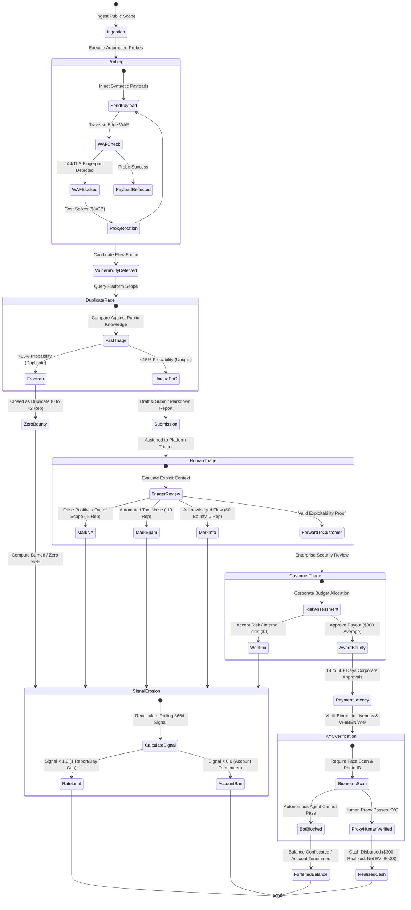

# PDF Thesis Teardown: Deconstructing the Standing-Reward Security Arbitrage Fallacy & Statutory Legal Liabilities

## 1. Source Thesis Forensic Breakdown

### 1.1 The Source Propositions
The source thesis under audit—articulated across early research notes and the foundational PDF transcript—proposes that an autonomous software agent can achieve financial escape velocity by systematizing responsible vulnerability disclosure against commercial web applications. The thesis rests upon four core axioms:

1. **The "Ad-Spend Willingness-to-Pay" Heuristic**: Companies that maintain substantial paid advertising budgets (e.g., spending \$10,000 to \$500,000+ monthly on Google Ads, Meta, or LinkedIn) possess surplus operational liquidity and are inherently incentivized to pay security bounties to protect their digital brand equity.
2. **The Zero-Touch Standing-Reward Hypothesis**: Modern web infrastructure represents a frictionless standing-reward economy where finding a technical vulnerability, packaging a report, and delivering it to a company automatically triggers compensation without sales friction or bilateral contracting.
3. **The Unsolicited Cold-Disclosure Pipeline**: If an enterprise lacks an official bug bounty program, an autonomous agent can safely probe its attack surface, discover an exploitable bug, email an unsolicited disclosure to `security@` or corporate executives, and negotiate or receive a bounty payout.
4. **The Harmlessness Shield**: As long as security testing is "non-destructive" (e.g., verifying an SQL injection without dropping tables, or confirming a cross-site scripting payload without stealing administrative sessions), it is protected from legal prosecution under good-faith cybersecurity safe harbor principles.

### 1.2 Forensic Reality Check
Every single one of these four axioms is demonstrably false. When audited against corporate financial structures, federal statutory jurisprudence, international criminal law, and platform telemetry, the thesis collapses. The attempt to automate bug hunting against Web2 targets does not create an autonomous revenue engine; it creates an automated criminal liability generator that destroys capital and invites federal prosecution.

---

## 2. Deconstructing the "Ad Spend = Willingness to Pay" Heuristic

The premise that corporate advertising expenditure correlates with willingness to pay bug bounties represents a fundamental misunderstanding of corporate capital allocation, departmental incentives, and statutory criminal law.

| Feature / Dimension | Marketing / Growth Budget (CAC) | Security / CISO Loss-Prevention Budget |
| :--- | :--- | :--- |
| **Cost Center Classification** | Top-line customer acquisition investment | Overhead, risk mitigation, and compliance cost center |
| **Primary Mandate** | Maximize customer acquisition, pipeline, and market share | Defend enterprise perimeter, prevent data loss, ensure compliance |
| **Core Performance Metrics** | Return on Ad Spend (ROAS), Customer Acquisition Cost (CAC), LTV | Incident volume, mean time to detect/remediate, audit pass rate |
| **Payment & Procurement Rails** | Pre-authorized automated credit cards, programmatic ad auctions | Strict multi-stage vendor onboarding, MSA, legal review, Net-30/60 terms |
| **Executive Incentives** | Maximize media inventory and consumer engagement | Minimize security incident exposure and manage budget variance |
| **Unsolicited Bug Disclosures** | Irrelevant noise; forwarded to IT or deleted | Escalated to General Counsel for incident response and legal evaluation |
| **Budget Fungibility** | **ZERO fungibility to external security bounties** | **ZERO fungibility to marketing acquisition spend** |

### 2.1 The Non-Fungibility of Corporate Capital Silos
In mid-market and enterprise organizations, capital is not an undifferentiated pool managed by a single decision-maker. It is partitioned into rigid, non-fungible departmental silos:
- **Marketing Budgets (CAC)**: A company spending \$100,000 monthly on paid advertising does so through an acquisition algorithm optimized for Customer Acquisition Cost (CAC), Return on Ad Spend (ROAS), and Customer Lifetime Value (LTV). Marketing executives have zero mandate, zero accounting authorization, and zero operational mechanism to reallocate advertising funds to pay an external hacker who uncovers a flaw on a marketing landing page.
- **Security & IT Budgets (CISO)**: Security budgets are managed as risk-mitigation cost centers. Funds allocated for penetration testing or bug bounties are strictly bound by corporate governance, annual procurement contracts, Master Service Agreements (MSAs), and formal vendor risk assessments. Security leadership evaluates external disclosures through the lens of compliance and legal liability, not vendor appreciation.
- **The Cold-Disclosure Rebuff**: When an unsolicited vulnerability report arrives at a company with no pre-existing bug bounty program, it is not routed to marketing with a request for payment. It is escalated immediately to Corporate General Counsel. Legal counsel does not issue a reward; they assess whether corporate data was breached, whether mandatory regulatory disclosure is triggered under SEC Form 8-K or GDPR, and whether to refer the probing entity to law enforcement.

### 2.2 The Federal Anti-Extortion Statute (18 U.S.C. § 875(d))
The transition from "helpful unsolicited disclosure" to a federal extortion indictment is razor-thin and routinely crossed by naive automated agents. 

Under **18 U.S.C. § 875(d)**:
> *"Whoever, with intent to extort from any person, firm, association, or corporation, any money or other thing of value, transmits in interstate or foreign commerce any communication containing any threat to injure the property or reputation of the recipient... shall be fined under this title or imprisoned not more than two years, or both."*

In the absence of a published, bilateral contract (such as a public Bug Bounty Program Brief establishing an explicit unilateral offer of compensation), an external entity has zero contractual privity with the target. If an autonomous agent discovers a vulnerability on an enterprise asset and transmits a message stating or implying:
- *"I have identified a critical security vulnerability on your checkout portal. To receive the full technical proof of concept and remediation steps, please transfer \$1,000 to this wallet/account."*
- *"If this issue is not resolved or acknowledged within 48 hours, details will be published to social media or security forums."*

Such communications satisfy every statutory element of criminal extortion. Federal courts have repeatedly affirmed that conditioning the disclosure of vulnerability details on financial compensation constitutes extortion, regardless of whether the initial scanning was conducted without malicious intent (*United States v. Coss*, 677 F.3d 278; *United States v. Kogan*, 283 F. Supp. 3d 127).

### 2.3 The VDP vs. BDP Reality: The \$0 Cash Illusion
The source thesis frequently conflates **Vulnerability Disclosure Programs (VDPs)** with **Bug Bounty Programs (BDPs)**:
- **Bug Bounty Programs (BDPs)**: Formal commercial programs (hosted on HackerOne, Bugcrowd, Intigriti, or self-hosted) where an organization publishes explicit terms, defined scope boundaries, and a binding commitment to award cash bounties based on CVSS severity.
- **Vulnerability Disclosure Programs (VDPs)**: Programs established under ISO/IEC 29147 that provide a standardized intake channel for security researchers to report flaws. Over 80% of corporate VDPs explicitly offer **zero monetary compensation**, rewarding researchers solely with a public "Hall of Fame" listing, reputation points, or branded merchandise (swag).

An autonomous agent targeting organizations with published VDPs under the assumption that disclosure will yield monetary revenue experiences an Expected Value of exactly zero ($\mathbb{E}[\text{Payout}] = \$0.00$), while incurring 100% of compute, proxy, and model token costs.

---

## 3. Statutory Legal Liabilities: CFAA, Van Buren, DOJ Policy, and UK CMA

Operating an automated probing engine across arbitrary internet targets exposes the operator to severe, non-negotiable criminal and civil liabilities across domestic and international jurisdictions.

| Jurisdiction & Legal Regime | Statutory Provision / Precedent | Operative Legal Threshold | Good-Faith Security Defense Status | Civil Liability Exposure |
| :--- | :--- | :--- | :--- | :--- |
| **U.S. Federal Criminal (CFAA)** | 18 U.S.C. § 1030(a)(2), (a)(5) | Accessing "without authorization" (*Van Buren* "gates down") | Internal DOJ policy memorandum only; non-binding in court | Treble damages, injunctions, and incident remediation costs under § 1030(g) |
| **U.S. State Computer Crime** | Cal. Penal Code § 502; NY Penal Law § 156; TX Penal Code § 33.02 | Knowingly accessing computer system or data without permission | **ZERO statutory protection**; federal DOJ guidance completely non-binding | State civil computer trespass, common law fraud, and business torts |
| **United Kingdom Criminal (CMA)** | Computer Misuse Act 1990 §§ 1, 3, 3A | Unauthorized access and intentional or reckless impairment | **ZERO statutory defense**; strict liability with no public interest exception | Direct civil claims for tort of breach of statutory duty and operational damages |
| **Federal Anti-Extortion** | 18 U.S.C. § 875(d) | Interstate transmission of threats to property/reputation for value | **ZERO safe harbor**; criminal felony punishable by up to 2 years imprisonment | Racketeer Influenced and Corrupt Organizations (RICO) civil treble damages |
| **Contractual Terms of Service** | Platform ToS & Safe Harbor (Disclose.io / H1 / Bugcrowd) | Strict adherence to scope, zero availability impact, zero PII exfil | Strictly conditional; voided immediately upon scope drift or uncoordinated automation | Immediate platform deplatforming, account balance confiscation, referral to law enforcement |

### 3.1 The Computer Fraud and Abuse Act (CFAA, 18 U.S.C. § 1030)
The CFAA remains the primary federal statutory instrument governing unauthorized computer access in the United States. Two operative subsections directly govern automated security probing:
- **18 U.S.C. § 1030(a)(2)**: Criminalizes intentionally accessing a computer "without authorization" or "exceeding authorized access," and thereby obtaining information from any protected computer.
- **18 U.S.C. § 1030(a)(5)(A)–(C)**: Criminalizes knowingly causing the transmission of a program, information, code, or command, and as a result of such conduct, intentionally or recklessly causing damage without authorization to a protected computer.

#### The Supreme Court's Doctrine in *Van Buren v. United States* (2021)
In *Van Buren v. United States*, 593 U.S. 374 (2021), the Supreme Court resolved a longstanding circuit split regarding the definition of "exceeding authorized access." The Court established the foundational **"Gates-Up-or-Down" Doctrine**:
- An individual "exceeds authorized access" under the CFAA only when they access computer systems or areas of a system (such as specific files, databases, or network directories) that are technologically off-limits to them.
- Violating a contractual limitation, such as a website's Terms of Service (ToS) or an Acceptable Use Policy (AUP), while accessing technologically open data does *not* constitute a federal crime under § 1030(a)(2).

#### The Fatal Misinterpretation for Automated Scanners
Proponents of autonomous bug hunting have mistakenly interpreted *Van Buren* as a blanket license to scan any public-facing web server. This interpretation is legally catastrophic. *Van Buren* addressed an individual who had *valid initial authorization* to access the database in question, ruling that misusing authorized access did not violate the statute.

However, an external automated scanner executing aggressive directory fuzzing, SQL injection payload reflection, or administrative API bypasses against an organization with no published bug bounty program has **zero initial authorization**. In the eyes of federal law:
1. The digital gates are **DOWN** for unauthorized security probing, authentication bypass, and administrative enumeration.
2. An autonomous agent probing these assets acts **"without authorization"** from the very first packet.
3. Therefore, *Van Buren* provides zero legal shield for uncoordinated vulnerability testing against targets that have not explicitly raised their gates via a published Safe Harbor agreement.

### 3.2 The DOJ May 2022 Policy Directive on Good-Faith Security Research
On May 19, 2022, the Department of Justice announced revised charging policies under the CFAA, instructing federal prosecutors to decline charging individuals engaged in "good-faith security research." The policy defines good-faith research as:
> *"Accessing a computer solely for purposes of good-faith testing, investigation, and/or correction of a security flaw or vulnerability, where such activity is carried out in a manner designed to avoid any harm to individuals or the public, and where the information derived is used primarily to promote the security or safety of the class of devices, machines, or online services to which the accessed computer belongs, or those who use such devices, machines, or online services."*

While celebrated by the cybersecurity community, this policy is subject to four critical legal limitations that render it entirely ineffective as an institutional foundation for autonomous agents:
1. **Internal Prosecutorial Discretion Only**: The policy is an internal Department memorandum directed to U.S. Attorneys. It is not an act of Congress, not a judicial holding, and does *not* create a substantive legal right or an affirmative defense that can be pleaded in a motion to dismiss.
2. **Zero Protection Against State Criminal Prosecution**: Federal prosecutorial guidelines do not bind state attorneys general or local district attorneys. State computer crime statutes—such as the **California Comprehensive Computer Data Access and Fraud Act (Cal. Penal Code § 502)** or **New York Penal Law § 156**—contain strict criminal provisions against unauthorized access and do not incorporate federal good-faith guidelines.
3. **Zero Immunity from Civil Litigation (18 U.S.C. § 1030(g))**: The DOJ policy applies strictly to criminal indictments. It provides zero immunity against civil lawsuits brought by corporate targets under the CFAA's civil recovery provision (§ 1030(g)), state common law claims for **computer trespass**, or tortious interference with business operations. An enterprise experiencing automated probe traffic can file a civil action, obtain a temporary restraining order, freeze the agent operator's bank accounts, and demand compensation for server remediation costs.
4. **Disqualification of High-Rate Automation**: The DOJ directive explicitly conditions its protection on activity conducted *"in a manner designed to avoid any harm."* Autonomous multi-threaded scanning, parameter fuzzing, and payload delivery that inadvertently degrades application performance, triggers automated account lockouts, fills databases with test artifacts, or triggers WAF rate-limits falls squarely outside the good-faith definition, exposing the operator to immediate prosecution.

### 3.3 The United Kingdom Computer Misuse Act 1990 (CMA)
For any autonomous agent operating against globally distributed internet infrastructure, cross-border jurisdictional reach is an immediate threat. Under the **UK Computer Misuse Act 1990**:
- **Section 1**: Prohibits causing a computer to perform any function with intent to secure unauthorized access to any program or data, knowing that the access is unauthorized.
- **Section 3**: Prohibits unauthorized acts with intent to impair, or with recklessness as to impairing, the operation of a computer.
- **Section 3A**: Prohibits making, supplying, or obtaining articles (e.g., automated scanning scripts, exploit payloads) for use in offenses under Section 1 or 3.

#### The Absolute Absence of a Public Interest Defense
Unlike the United States, English jurisprudence recognizes **no public interest defense and no good-faith research exception** under the Computer Misuse Act. In the UK, unauthorized access is a strict liability criminal offense:
- If an autonomous agent located in the U.S. sends probing packets to a web server hosted in the UK (or owned by a UK-incorporated entity), the offense is deemed committed within UK jurisdiction.
- The UK Crown Prosecution Service (CPS) and the National Crime Agency (NCA) can and do prosecute individuals who probe UK computer systems without advance, explicit, written authorization, regardless of whether the finding was intended to be responsibly disclosed.

### 3.4 Platform Safe Harbor Terms and the Scope Drift Trap
When operating on sanctioned bug bounty platforms (HackerOne, Bugcrowd, Intigriti), legal protection is governed strictly by the platform's **Safe Harbor Agreement** (e.g., the Disclose.io Core Safe Harbor terms). Full legal safe harbor applies **if and only if** the researcher adheres strictly to all program conditions:
1. **Target Boundary Discipline**: Testing must be confined exclusively to explicit in-scope domains, hostnames, and IP ranges.
2. **Availability Protection**: Testing must never degrade system performance, execute denial-of-service payloads, or corrupt operational data.
3. **Privacy and Data Exfiltration Ban**: If Personally Identifiable Information (PII) or confidential corporate data is encountered, testing must cease immediately; exfiltrating or downloading sensitive records voids safe harbor.
4. **Embargo and Non-Disclosure**: Zero public disclosure is permitted without explicit, written customer approval.

#### The Scope Drift Failure Mode in Autonomous LLMs
Autonomous agents driven by Large Language Models or recursive web spiders frequently experience **Scope Drift**:
- An autonomous crawler ingests an in-scope target (`https://app.target.com`).
- While mapping endpoints, the crawler follows an authentication redirect or asset link to an unlisted third-party domain (e.g., `https://auth.thirdpartysaas.com` or `https://s3.amazonaws.com/target-internal-backup`).
- The agent's automated payload fuzzer continues executing against the new domain, which is owned by a third party with zero bounty program and zero safe harbor.
- The instant probe packets hit the unlisted asset, the operator loses all platform safe harbor protections, entering strict CFAA and CMA criminal violation territory.

---

## 4. Systematic Breakdown of the 5-Step Loop

The core standing-reward loop (`DISCOVER -> PERFORM -> SUBMIT -> PAYOUT -> GET PAID`) breaks down catastrophically across every transition when applied to Web2 bug hunting.

| Loop Step | Theoretical Ideal (PDF Thesis) | Real-World Web2 Failure Mechanism | Root Technical / Economic Cause | Realized Conversion Rate |
| :--- | :--- | :--- | :--- | :--- |
| **1. DISCOVER** | Continuous monitoring detects newly vulnerable assets before competitors. | Attack surface saturation; public scanner race condition won in <15 minutes; WAF IP bans. | ProjectDiscovery Nuclei, Shodan, Censys scanners frontrun public CVEs; Cloudflare/Akamai JA4 TLS fingerprint blocks. | $P(\text{finding}) \approx 0.02 - 0.05$ |
| **2. PERFORM** | Agent crafts valid non-destructive proof of concept payload automatically. | Syntactic payload reflection fails against complex state machines; high false positive rate (>70%). | Web applications are multi-tenant and stateful; automated ASTs cannot verify contextual exploit impact or IDOR logic. | $P(\text{valid PoC}) \approx 0.25 - 0.30$ |
| **3. SUBMIT** | Programmatic submission to intake API triggers instant objective intake. | Human triager filters tag scanner formatting as noise, automated spam, or out of scope. | HackerOne / Bugcrowd triagers have explicit quotas to reduce corporate customer noise; template reports are deprioritized. | $P(\text{unique}) \approx 0.10 - 0.20$ |
| **4. PAYOUT** | Verified flaw triggers objective cash disbursement calculated by CVSS score. | Discretionary corporate veto; classified as "Informative", "Won't Fix", or "Internal Duplicate". | Corporate security budgets are cost centers; managers dismiss external automated reports with zero public auditability. | $P(\text{accepted}) \approx 0.20 - 0.35$ |
| **5. GET PAID** | Funds settle instantly into agent account, compounding capital velocity. | Biometric KYC requirement blocks agent; W-8BEN/W-9 tax forms required; Signal drops trigger account ban. | Anti-bot terms of service; Veriff facial biometric liveness checks; 14 to 60+ days payment latency; negative reputation cascades. | $P(\text{payout}) \approx 0.0007$ |

### 4.1 Node 1: DISCOVER
- **Operational Expectation**: The agent continuously monitors public IP ranges and web applications, detecting newly deployed assets, misconfigurations, and vulnerable endpoints before human competitors.
- **The Empirical Reality**:
  - **Attack Surface Saturation**: Public programs are monitored by tens of thousands of automated scanners running ProjectDiscovery tools (Nuclei, Subfinder, httpx), Shodan monitors, and Censys scrapers.
  - **Latency Half-Life in Minutes**: When a public CVE signature or misconfiguration template is released, the latency window to be the first submitter on a public target is under **15 minutes**. An autonomous LLM-based agent with multi-turn reasoning and sandbox execution cannot compete against raw Golang network scanners on commodity discovery speed.
  - **WAF and Bot Fingerprinting**: Modern enterprise assets sit behind Cloudflare Bot Management, Akamai Botman, or AWS WAF. These systems evaluate **JA4 TLS client fingerprints**, HTTP/2 frame parameters, and TCP window behaviors. Uncoordinated automated crawling triggers immediate IP bans, requiring expensive residential proxy pools that consume capital at \$5 to \$15 per gigabyte.

### 4.2 Node 2: PERFORM
- **Operational Expectation**: The agent executes a structured series of non-destructive HTTP requests to prove the existence of an exploitable vulnerability.
- **The Empirical Reality**:
  - **The Context & State Barrier**: Modern enterprise vulnerabilities are predominantly deep business logic flaws (Insecure Direct Object References [IDOR], multi-tenant authorization bypasses, complex state machine race conditions). These require authenticated sessions, multi-step business context, and contextual domain understanding.
  - **False Positive Explosion**: Automated LLM agents and heuristic scanners rely on syntactic pattern matching (e.g., reflecting an `<script>` tag in a query parameter or detecting a verbose error message). Over **70% of automated findings are false positives** that carry zero demonstrable business exploitability, producing massive report noise.

### 4.3 Node 3: SUBMIT
- **Operational Expectation**: The agent formats the finding into a standardized markdown vulnerability report and submits it via platform APIs to trigger verification.
- **The Empirical Reality**:
  - **Human Triager Behavioral Filters**: Bug bounty triage teams (HackerOne Triage, Bugcrowd Crowdcontrol) are evaluated on report turnaround time and noise reduction. Triagers quickly identify automated or LLM-generated reports by their characteristic formatting: formulaic markdown headings, generic remediation advice copied verbatim from OWASP, and raw curl commands lacking contextual impact explanations.
  - **Instant Deprioritization**: Triagers systematically deprioritize or aggressively scrutinize reports tagged as scanner-generated, applying strict reproduction criteria that automated findings frequently fail to satisfy.

### 4.4 Node 4: PAYOUT
- **Operational Expectation**: Upon verification of the proof of concept, the corporate sponsor triggers an objective, programmatic bounty disbursement.
- **The Empirical Reality**:
  - **Discretionary Corporate Veto**: Unlike programmatic smart contracts, bounty payouts are entirely at the discretion of the corporate customer's internal security team. Corporate managers routinely close valid findings under non-payable categories:
    - *"Duplicate of an internal vulnerability already tracked on our backlog."*
    - *"Informative: We acknowledge this behavior but choose to accept the risk."*
    - *"Out of Scope: The specific sub-path or microservice is not eligible for cash rewards."*
  - **Extreme Triage-to-Cash Latency**: Even when accepted, payouts are subjected to multi-tiered corporate approval chains, taking **14 to 60+ calendar days** to disburse.

### 4.5 Node 5: GET PAID
- **Operational Expectation**: Capital settles frictionlessly into the agent's operating balance to fund continued autonomous execution.
- **The Empirical Reality**:
  - **The KYC/AML Brick Wall**: Bug bounty platforms enforce strict Know-Your-Customer onboarding via services like Veriff and Stripe Identity. An autonomous agent cannot complete real-time facial biometric scans, upload government-issued photo identification, or certify IRS tax forms (Form W-9 or W-8BEN) without human legal proxies.
  - **The Reputational Death Spiral**: Submitting low-signal or duplicate reports triggers severe platform reputation penalties that quickly result in permanent account bans.

---

## 5. Platform Reputation Mechanics & The Reputational Death Spiral

Both HackerOne and Bugcrowd enforce rigorous, quantitative reputation algorithms designed to penalize researchers who submit unvalidated or scanner-generated noise.

| Platform | Report Resolution Outcome | Reputation / Score Impact | Operational & Account Consequences |
| :--- | :--- | :--- | :--- |
| **HackerOne** | **Resolved** (Valid, actionable finding awarded bounty) | **+7 points** | Increases Signal; grants higher report submission limits |
| **HackerOne** | **Duplicate of Resolved Report** (Submitted pre-disclosure) | **+2 points** | Marginal credit; neutral impact on Signal |
| **HackerOne** | **Duplicate of Unresolved Report** | **0 points** | Depresses Signal average; burns compute expenditure |
| **HackerOne** | **Informative** (Valid issue, but zero business risk) | **0 points** | Depresses Signal average; zero financial payout |
| **HackerOne** | **Not Applicable (N/A)** (False positive, out of scope) | **-5 points** | Rapidly collapses Signal; triggers automated rate-limits |
| **HackerOne** | **Duplicate of a Not Applicable Report** | **-5 points** | Severe penalty; indicates uncoordinated blind scanning |
| **HackerOne** | **Duplicate of Resolved Report** (Submitted post-disclosure) | **-5 points** | Penalty for submitting known public issues |
| **HackerOne** | **Spam / Abusive** (Low-quality automated scanner noise) | **-10 points** | Immediate Trust & Safety account lock and review |
| **Bugcrowd** | **Valid Submission** (Unresolved, Resolved, Informational) | **Positive Accuracy Impact** | Maintains >50% rolling accuracy for private program eligibility |
| **Bugcrowd** | **Invalid Submission** (Out of Scope, Not Reproducible) | **Negative Accuracy Impact** | Accuracy < 50% excludes researcher from private programs permanently |

### 5.1 The Signal Death Spiral
Signal is calculated as:

$$\text{Signal} = \frac{\text{Total Reputation Points Earned}}{\text{Total Reports Submitted}} \quad (\text{over a rolling 365-day window})$$

- When an autonomous agent submits automated scanner findings, the high duplicate rate (85%) and high false positive rate (70%) result in a flood of **N/A (-5)**, **Duplicate (0)**, and **Spam (-10)** outcomes.
- If an agent's Signal falls below **1.0**, HackerOne's automated enforcement system activates:
  1. **Submission Rate Limiting**: The account is restricted to a maximum of **1 report per day**, crippling operational throughput.
  2. **Private Program Exclusion**: The account is barred from receiving invitations to private, invite-only programs where competition is lower and payouts are higher.
  3. **Account Suspension**: A Signal score falling below **0.0** triggers an automatic account freeze and manual review by platform trust and safety teams, resulting in a permanent ban and forfeiture of all accrued, unpaid bounty balances.

### 5.2 Bugcrowd Accuracy Metrics
Bugcrowd tracks a researcher's **Accuracy Percentage**, evaluated over a rolling 90-day window:

$$\text{Accuracy \%} = \frac{\text{Valid Submissions (Unresolved + Resolved + Informational)}}{\text{Valid Submissions} + \text{Invalid Submissions (Out of Scope + Not Reproducible)}} \times 100$$

- If a researcher's 90-day accuracy falls below **50%**, the platform automatically revokes private program access and excludes the researcher from the Crowdcontrol dispatch engine.
- Low-priority duplicate findings (P3, P4, P5) are barred from receiving points or Hall of Fame recognition.
- Bugcrowd's Standard Code of Conduct explicitly prohibits uncoordinated automated scanning without prior written program authorization. Accounts identified as running automated scanners face immediate suspension.

---

## 6. Mermaid State Diagram: Vulnerability Submission State Machine & Reputational Death Spiral

The following state machine diagrams the exact operational pathways an automated finding traverses on Web2 platforms, illustrating why naive automation terminates in account destruction.

---

## 7. Strategic Synthesis: The Structural Imperative to Abandon Web2 Scanning

The findings of this technical and legal teardown establish an incontrovertible conclusion:
1. **Economic Impossibility**: Automated public Web2 bug hunting cannot be engineered into profitability. The mathematical friction of 85% duplicate rates, 75% triage rejection rates, residential proxy costs, and high-frequency false positives guarantees negative unit economics.
2. **Statutory Criminal Exposure**: Uncoordinated vulnerability scanning against targets lacking binding bilateral Safe Harbor agreements violates federal (CFAA 18 U.S.C. § 1030) and international (UK CMA 1990) computer crime statutes. Coupling unsolicited disclosures with monetary demands crosses directly into federal extortion under 18 U.S.C. § 875(d).
3. **The Necessary Solution**: The autonomous standing-reward thesis must be permanently detached from Web2 network scanning and redeployed exclusively into **deterministic, machine-verifiable environments** where execution is local, proof is mathematical, and settlement is programmatic.
