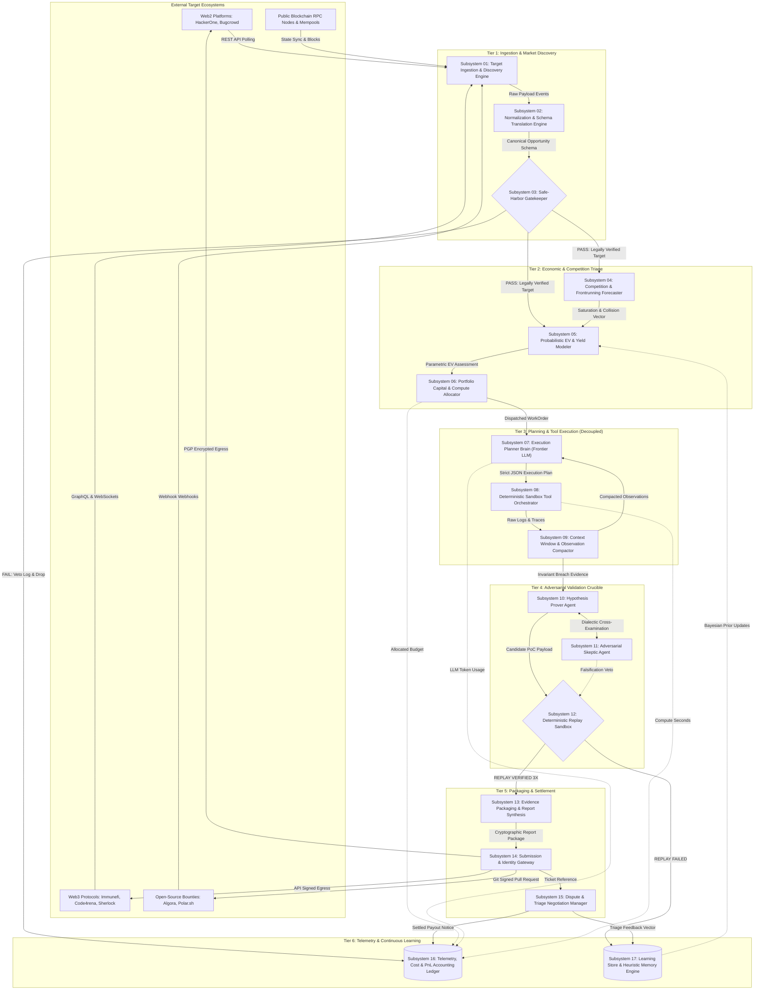
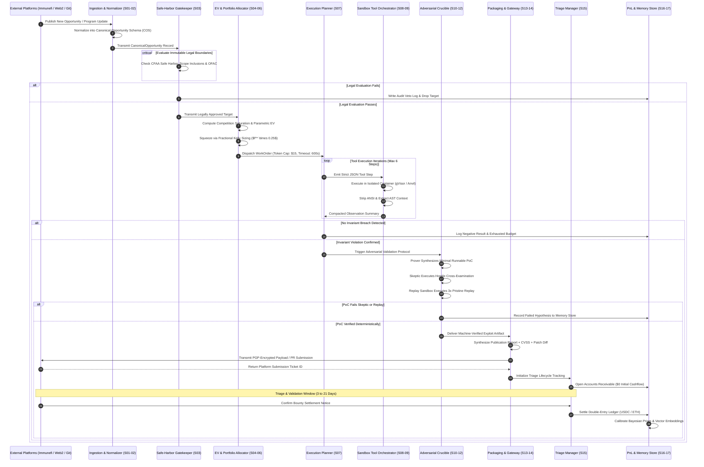
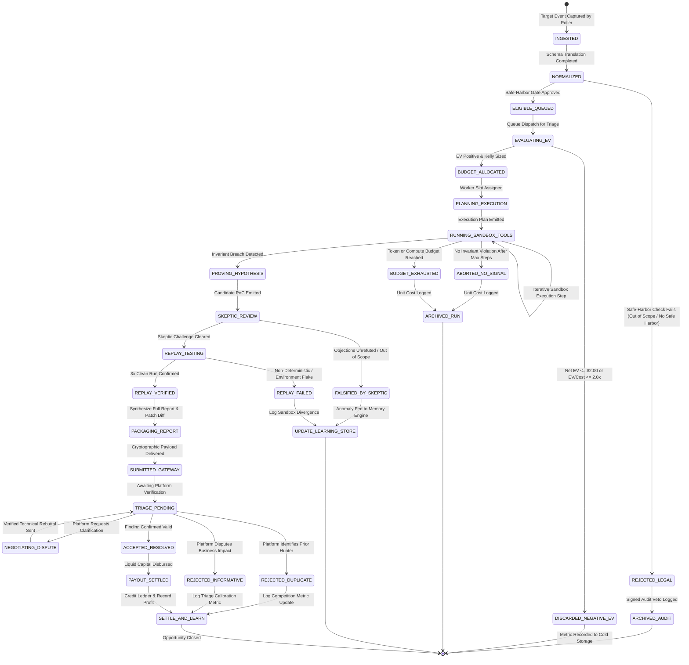
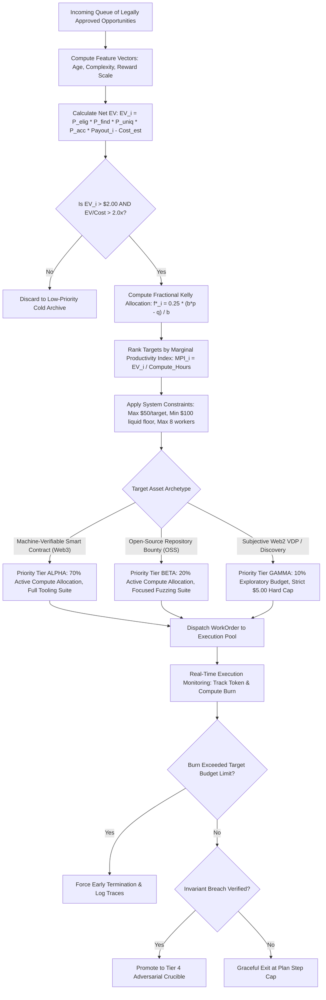

# Autonomous System Architecture: End-to-End Technical Specification of the Autonomous Opportunity Arbitrage Engine (AOAE)

## 1. Executive Architectural Blueprint & Operating Principles

### 1.1 The Closed-Loop Opportunity Arbitrage Paradigm
The Autonomous Opportunity Arbitrage Engine (AOAE) is an institutional-grade, fully automated software system engineered to execute the programmatic standing-reward lifecycle:
$$\text{DISCOVER TARGET} \longrightarrow \text{TRIAGE & ALLOCATE} \longrightarrow \text{PLAN & PROVE} \longrightarrow \text{ADVERSARIAL VERIFY} \longrightarrow \text{PACKAGE & SETTLE} \longrightarrow \text{LEARN}$$

Unlike conventional workflow automation or open-loop vulnerability scanners, the AOAE operates under strict closed-loop constraints:
1. **Zero Human Sales & Outreach**: Opportunities are ingested exclusively from public, standing reward contracts, programmatic bug bounty protocols, and deterministic smart contract systems.
2. **Zero Subjective Negotiation**: Target triage prioritizes machine-verifiable domains where state transition validity is decidable via local execution sandboxes.
3. **Decoupled Reasoning and Execution**: Autonomous cognitive planning (the "Brain") is strictly separated from deterministic, containerized runtime environments (the "Hands").
4. **Adversarial Dual-Agent Validation**: Candidate findings must survive a rigorous dialectic debate between an exploit-generating Prover agent and a hostile Skeptic agent, followed by mandatory triple deterministic replay.
5. **Continuous Economic Feedback**: Real-time telemetry dynamically feeds a double-entry financial ledger and updates Bayesian prior distributions governing portfolio capital allocation.

### 1.2 Core Architectural Imperatives: Decoupled Brain vs. Hands
The central failure vector in generative-agent architectures is cognitive pollution: allowing a probabilistic Large Language Model (LLM) direct execution authority, or permitting messy runtime side-effects to pollute the reasoning context.

The AOAE enforces an architectural barrier between two operational realms:
- **The Epistemic Brain (Subsystem 07, 10, 11)**: High-reasoning foundation models (e.g., Anthropic Claude 3.5 Sonnet, OpenAI GPT-4o) tasked with abstract decomposition, hypothesis generation, and semantic exploit reasoning. The Brain emits strictly typed, schema-validated JSON execution plans and invariant claims. The Brain has zero network access, zero direct shell execution capability, and zero persistent local storage access.
- **The Deterministic Hands (Subsystem 08, 12)**: Ephemeral, hardened container environments (gVisor runtimes, Firecracker microVMs, and isolated Foundry Anvil EVM testnets). The Hands receive declarative execution commands, execute compiler runs, static analyzers, and fuzzers, and capture raw binary outputs.
- **The Context Compactor (Subsystem 09)**: Positioned between Hands and Brain, this deterministic filtering proxy strips ANSI escape sequences, deduplicates compiler dumps, isolates Abstract Syntax Tree (AST) contexts, and enforces strict token budgets, preventing context-window exhaustion and hallucinations.

### 1.3 Epistemic Verification & Adversarial Falsification
To eliminate false-positive submissions and protect operator reputation, the system establishes a mathematical standard of proof:
$$\delta_{\text{local}}(s_t, T^*) \equiv \delta_{\text{mainnet}}(s_t, T^*) \implies \mathcal{P}_{\text{violation}}(s') = \text{TRUE}$$
An exploit hypothesis is recognized as valid if and only if:
1. It is synthesized by the **Hypothesis Prover** (Subsystem 10).
2. It withstands adversarial cross-examination by the **Adversarial Skeptic** (Subsystem 11), which attempts to falsify the claim against program scope, out-of-scope conditions, and known bug databases.
3. It achieves three consecutive successful passes ($3\times$) in the **Deterministic Replay Sandbox** (Subsystem 12) inside a freshly minted, hermetic environment.

### 1.4 The Six Operational Tiers Overview
The system's 17 subsystems are structured across six distinct operational tiers, each executing an isolated phase of the economic pipeline:
- **Tier 1: Ingestion & Market Discovery (Subsystems 01-03)**: Ingests heterogeneous platform streams, normalizes them into Canonical Opportunity Schemas (COS), and enforces immutable legal safe-harbor gates.
- **Tier 2: Economic & Competition Triage (Subsystems 04-06)**: Analyzes target saturation, forecasts duplicate collision risk, calculates parametric Expected Value (EV), and sizes compute resources via Fractional Kelly allocation.
- **Tier 3: Planning & Tool Execution (Subsystems 07-09)**: Decomposes targets into formal execution plans, executes isolated sandbox tools, and compacts execution observations.
- **Tier 4: Adversarial Validation Crucible (Subsystems 10-12)**: Pits the Prover against the Skeptic in an epistemic debate loop and verifies candidate PoCs in a clean deterministic sandbox.
- **Tier 5: Packaging & Settlement (Subsystems 13-15)**: Generates publication-grade security reports, transmits cryptographic payloads via platform gateways, and manages triage dispute lifecycles.
- **Tier 6: Telemetry & Continuous Learning (Subsystems 16-17)**: Maintains double-entry unit-economic accounting ledgers and updates Bayesian prior distributions in vector memory.

---

## 2. High-Fidelity Architecture Topology

The following diagram illustrates the complete architectural layout, showing subsystem boundaries, data flow vectors, network isolation enclaves, and cryptographic barriers.



---

## 3. The Canonical Opportunity Schema (COS) Specification

### 3.1 JSON Schema Specification
To unify opportunities originating from disparate platforms (Immunefi, HackerOne, Bugcrowd, Algora, Code4rena, GitHub), the Normalization Engine emits a standardized, strongly-typed JSON schema: `CanonicalOpportunity`.

```json
{
  "$schema": "https://json-schema.org/draft/2020-12/schema",
  "title": "CanonicalOpportunity",
  "type": "object",
  "required": [
    "canonical_id",
    "source_platform",
    "platform_target_id",
    "target_name",
    "asset_archetype",
    "ingested_at",
    "legal_safe_harbor",
    "scope_inclusions",
    "scope_exclusions",
    "reward_structure",
    "test_environment"
  ],
  "properties": {
    "canonical_id": {
      "type": "string",
      "format": "uuid",
      "description": "Global unique identifier generated via UUIDv5(source_platform + platform_target_id)."
    },
    "source_platform": {
      "type": "string",
      "enum": ["IMMUNEFI", "HACKERONE", "BUGCROWD", "CODE4RENA", "SHERLOCK", "ALGORA", "POLAR", "ONCHAIN_FEED"]
    },
    "platform_target_id": {
      "type": "string",
      "description": "Original platform program identifier or repository slug."
    },
    "target_name": {
      "type": "string",
      "description": "Human-readable organization, protocol, or repository title."
    },
    "asset_archetype": {
      "type": "string",
      "enum": ["SMART_CONTRACT_EVM", "SMART_CONTRACT_SOLANA", "OPEN_SOURCE_REPO", "WEB2_APPLICATION", "ONCHAIN_MEMPOOL"]
    },
    "ingested_at": {
      "type": "string",
      "format": "date-time"
    },
    "legal_safe_harbor": {
      "type": "object",
      "required": ["has_explicit_safe_harbor", "safe_harbor_type", "requires_kyc", "terms_hash"],
      "properties": {
        "has_explicit_safe_harbor": { "type": "boolean" },
        "safe_harbor_type": {
          "type": "string",
          "enum": ["FULL_DISCLOSURE_SAFE_HARBOR", "GOLD_STANDARD", "PARTIAL_CFAA_ONLY", "NONE"]
        },
        "requires_kyc": { "type": "boolean" },
        "terms_hash": { "type": "string", "pattern": "^0x[0-9a-fA-F]{64}$" }
      }
    },
    "scope_inclusions": {
      "type": "array",
      "items": {
        "type": "object",
        "required": ["target_address_or_url", "asset_type", "max_severity"],
        "properties": {
          "target_address_or_url": { "type": "string" },
          "asset_type": { "type": "string" },
          "source_code_url": { "type": "string" },
          "commit_hash": { "type": "string" },
          "chain_id": { "type": "integer" },
          "max_severity": { "type": "string", "enum": ["CRITICAL", "HIGH", "MEDIUM", "LOW"] }
        }
      }
    },
    "scope_exclusions": {
      "type": "array",
      "items": { "type": "string" },
      "description": "Regex patterns matching out-of-scope endpoints, third-party libraries, or excluded contracts."
    },
    "reward_structure": {
      "type": "object",
      "required": ["currency", "critical_payout_usd", "high_payout_usd", "payout_rail"],
      "properties": {
        "currency": { "type": "string", "enum": ["USDC", "USDT", "ETH", "USD"] },
        "critical_payout_usd": { "type": "number", "minimum": 0 },
        "high_payout_usd": { "type": "number", "minimum": 0 },
        "medium_payout_usd": { "type": "number", "minimum": 0 },
        "low_payout_usd": { "type": "number", "minimum": 0 },
        "payout_rail": { "type": "string", "enum": ["ONCHAIN_ESCROW", "DIRECT_CRYPTO", "FIAT_STRIPE", "MANUAL_INVOICE"] }
      }
    },
    "test_environment": {
      "type": "object",
      "required": ["execution_mode", "compiler_version"],
      "properties": {
        "execution_mode": { "type": "string", "enum": ["ANVIL_LOCAL_FORK", "DOCKER_ISOLATED", "LOCAL_BUILD"] },
        "compiler_version": { "type": "string" },
        "rpc_fork_block": { "type": "integer" }
      }
    }
  }
}
```

### 3.2 Ingestion Adapters and Data Normalization
The Normalization Engine implements deterministic adapters that map idiosyncratic platform APIs into the Canonical Opportunity Schema:
- **Immunefi Adapter**: Queries the GraphQL API, parses reward tiers, verifies contract verification status via Etherscan API, and extracts verified Solidity code artifacts.
- **HackerOne Adapter**: Polls the HackerOne Hacker API v1, parses program policy markdown, extracts structured scopes, and flags whether safe-harbor legal terms are explicitly declared.
- **Algora / Polar Adapter**: Subscribes to webhook endpoints, maps open issue bounties, pulls git commit trees, and confirms reproduction test harnesses.

---

## 4. Deep-Dive Specification of the 17 Modular Subsystems

### 4.1 Tier 1: Ingestion & Market Discovery

#### Subsystem 01: Target Ingestion & Discovery Engine
- **Inputs**:
  - Immunefi GraphQL endpoint (`https://api.immunefi.com/graphql`)
  - HackerOne REST API v1 (`https://api.hackerone.com/v1/hackers/programs`)
  - Bugcrowd REST API (`https://tracker.bugcrowd.com/programs.json`)
  - Algora / Polar.sh webhook feeds and REST endpoints
  - Ethereum / Arbitrum / Base RPC block headers and contract creation logs (`eth_subscribe("newHeads")`)
- **Core Process & Algorithms**:
  - High-frequency polling worker pool running on an asynchronous event loop (Python `asyncio` / Rust `tokio`).
  - Implements SHA-256 deduplication hashing over raw program metadata payloads:
    $$\text{Hash} = \text{SHA-256}(\text{Platform} \parallel \text{ProgramID} \parallel \text{PolicyVersion} \parallel \text{UpdatedAt})$$
  - Change-detection diff engine computes delta trees against the local `raw_opportunities` store. If policy or contract addresses change, an ingestion event is triggered.
  - Rate-limit governance: Adaptive token-bucket algorithm per external domain, preventing HTTP 429 throttling and IP bans.
- **Outputs**:
  - Stream of `RawOpportunityEvent` payloads:
    ```json
    {
      "event_id": "evt_981a2f4",
      "source_platform": "IMMUNEFI",
      "source_program_id": "aave-v3",
      "raw_payload": { ... },
      "ingestion_timestamp": 1773820800,
      "payload_hash": "0x7a8b...3c2e"
    }
    ```
- **Failure Modes & Mitigations**:
  - *Platform Rate Limiting / WAF Blocks*: Rotates residential proxies with sticky 10-minute sessions; backs off exponentially with random jitter ($t_{\text{wait}} = 2^k + \text{Uniform}(0, 1)$).
  - *Platform API Schema Drift*: Emits high-priority error telemetry to Subsystem 16; isolates anomalous payloads into a dead-letter quarantine table (`quarantine_raw_payloads`) for schema adjustment.
- **Data Stored**:
  - Table: `raw_opportunities`
    - `id`: BIGSERIAL PRIMARY KEY
    - `source_platform`: VARCHAR(32) NOT NULL
    - `platform_target_id`: VARCHAR(128) NOT NULL
    - `payload_hash`: CHAR(64) UNIQUE NOT NULL
    - `raw_json`: JSONB NOT NULL
    - `created_at`: TIMESTAMPTZ DEFAULT NOW()
- **Automation Level**: Level 5 (Fully Autonomous). Operates continuously without human intervention.

---

#### Subsystem 02: Normalization & Schema Translation Engine
- **Inputs**:
  - Stream of `RawOpportunityEvent` records from Subsystem 01.
  - Platform-specific parsing grammar rules and regex extraction templates.
- **Core Process & Algorithms**:
  - Deterministic Abstract Syntax Tree (AST) markdown parsers extract structured asset tables from program descriptions.
  - Currency normalization: Standardizes heterogeneous payout tokens into USD equivalents using real-time CoinGecko / Chainlink oracle price feeds:
    $$\text{USD Value} = \text{Nominal Payout} \times \text{Price}_{\text{Token/USD}}$$
  - Scope categorization: Segregates in-scope smart contract addresses, domain wildcards, and Git repositories from explicit exclusion lists.
  - Schema validation: Compiles and validates normalized records against the `CanonicalOpportunity` JSON schema using strict Draft 2020-12 validators.
- **Outputs**:
  - Validated `CanonicalOpportunity` JSON objects ready for legal gating.
- **Failure Modes & Mitigations**:
  - *Unparseable Scope Markdown*: Unstructured markdown tables or ambiguous natural language boundaries. *Mitigation*: Fallback to a localized, constrained Small Language Model (SLM, e.g., Llama-3-8B) with zero-temperature JSON-mode extraction; if validation fails twice, quarantine to manual review queue.
- **Data Stored**:
  - Table: `canonical_opportunities`
    - `canonical_id`: UUID PRIMARY KEY
    - `raw_opportunity_id`: BIGINT REFERENCES raw_opportunities(id)
    - `source_platform`: VARCHAR(32) NOT NULL
    - `target_name`: VARCHAR(255) NOT NULL
    - `asset_archetype`: VARCHAR(64) NOT NULL
    - `canonical_data`: JSONB NOT NULL
    - `parser_version`: VARCHAR(16) NOT NULL
    - `created_at`: TIMESTAMPTZ DEFAULT NOW()
- **Automation Level**: Level 5 (Fully Autonomous).

---

#### Subsystem 03: Eligibility & Safe-Harbor Gatekeeper (Immutable Legal Veto)
- **Inputs**:
  - `CanonicalOpportunity` records from Subsystem 02.
  - Global Legal Policy Ruleset (codified statutory compliance rules).
  - Global Blacklist (sanctioned addresses, banned entities, non-authorizing domains).
- **Core Process & Algorithms**:
  - Hard-coded, non-overridable deterministic boolean gatekeeper.
  - Evaluates five mandatory compliance conditions:
    1. **Explicit Safe Harbor Clause**: Confirms presence of binding legal text granting exemption from CFAA (18 U.S.C. § 1030) and UK CMA 1990.
    2. **Asset Authorization Check**: Confirms target asset is explicitly listed in `scope_inclusions` and does not match any regex in `scope_exclusions`.
    3. **Zero Active Probe Prohibition**: Verifies that testing can occur strictly against local execution forks or offline codebases; rejects any target requiring active network intrusion against live hosts without bilateral contracts.
    4. **Sanctions & Compliance Check**: Verifies target protocol, deployer addresses, and platform are absent from the OFAC Specially Designated Nationals (SDN) list.
    5. **KYC / Identity Feasibility**: Assesses whether payout rails require biometric liveness checks that violate autonomous operator capabilities.
  - Evaluates decision predicate:
    $$\text{GateDecision} = \bigwedge_{i=1}^{5} C_i \in \{\text{APPROVED}, \text{REJECTED}\}$$
  - Cryptographically signs approved decisions using the engine's internal ed25519 legal audit key.
- **Outputs**:
  - `GateDecision` structure:
    ```json
    {
      "canonical_id": "9b1deb4d-3b7d-4bad-9bdd-2b0d7b3dcb6d",
      "decision": "APPROVED",
      "rules_passed": ["CFAA_SAFE_HARBOR", "SCOPE_EXPLICIT", "LOCAL_FORK_ELIGIBLE", "OFAC_CLEAR", "PAYOUT_COMPLIANT"],
      "signature": "0x3f9a...88c1",
      "evaluated_at": 1773820810
    }
    ```
- **Failure Modes & Mitigations**:
  - *Ambiguous Legal Terms*: Program policy contains conflicting or vague safe-harbor clauses. *Mitigation*: Fail-closed default. Any ambiguity triggers an immediate, non-negotiable `REJECTED_LEGAL` verdict. Zero exceptions.
- **Data Stored**:
  - Table: `audit_gate_logs`
    - `id`: BIGSERIAL PRIMARY KEY
    - `canonical_id`: UUID REFERENCES canonical_opportunities(canonical_id)
    - `decision`: VARCHAR(32) NOT NULL
    - `evaluated_rules`: JSONB NOT NULL
    - `signature`: VARCHAR(128) NOT NULL
    - `timestamp`: TIMESTAMPTZ DEFAULT NOW()
- **Automation Level**: Level 5 (Deterministic Binary Veto). Zero human override capability.

---

### 4.2 Tier 2: Economic & Competition Triage

#### Subsystem 04: Competition & Frontrunning Forecaster
- **Inputs**:
  - Target creation timestamp and last contract deployment date.
  - Platform metrics: Number of registered researchers, public leaderboard activity, submission counters.
  - Git commit velocity: Number of commits, active PRs, and active contributors on target repository.
  - Historical platform duplicate density data from Subsystem 17.
- **Core Process & Algorithms**:
  - Temporal Saturation Decay Model: Models the probability that an undiscovered, scanner-findable vulnerability remains accessible as an exponential decay function of target age $t$:
    $$S(t) = S_{\text{base}} \cdot e^{-\lambda t}$$
    where $\lambda$ is the empirical competition velocity parameter calibrated per platform (e.g., $\lambda_{\text{Web2}} = 0.15 \text{ hr}^{-1}$, $\lambda_{\text{Web3}} = 0.02 \text{ hr}^{-1}$).
  - Frontrunning Collision Estimator: Calculates the duplicate probability ($P_{\text{dup}}$) based on researcher density $N$ and target publicity index $\omega$:
    $$P_{\text{dup}} = 1 - \left(1 - \rho_{\text{platform}}\right)^{\ln(1 + N \cdot \omega)}$$
  - Evaluates `saturation_index` $\in [0.0, 1.0]$ and `frontrunning_risk` $\in [0.0, 1.0]$.
- **Outputs**:
  - `CompetitionMetrics` record:
    ```json
    {
      "canonical_id": "9b1deb4d-3b7d-4bad-9bdd-2b0d7b3dcb6d",
      "target_age_hours": 14.5,
      "saturation_index": 0.32,
      "frontrunning_risk": 0.18,
      "expected_competing_hunters": 6,
      "computed_at": 1773820815
    }
    ```
- **Failure Modes & Mitigations**:
  - *Cold-Start Platforms*: New platforms lacking historical duplicate data. *Mitigation*: Defaults to conservative 90th percentile competition assumptions ($P_{\text{dup}} = 0.85$).
- **Data Stored**:
  - Table: `target_competition_metrics`
    - `id`: BIGSERIAL PRIMARY KEY
    - `canonical_id`: UUID REFERENCES canonical_opportunities(canonical_id)
    - `saturation_index`: NUMERIC(4,3) NOT NULL
    - `frontrunning_risk`: NUMERIC(4,3) NOT NULL
    - `metrics_payload`: JSONB NOT NULL
    - `created_at`: TIMESTAMPTZ DEFAULT NOW()
- **Automation Level**: Level 5 (Fully Autonomous).

---

#### Subsystem 05: Probabilistic EV & Yield Modeler
- **Inputs**:
  - `CanonicalOpportunity` (reward tiers, asset type).
  - `CompetitionMetrics` from Subsystem 04.
  - Historical performance priors from Subsystem 17 (empirical finding probability $\theta_{\text{find}}$, acceptance probability $\theta_{\text{acc}}$).
- **Core Process & Algorithms**:
  - Parametric Expected Value (EV) Formulation:
    $$\mathbb{E}[\text{EV}] = P_{\text{elig}} \times P_{\text{find}} \times (1 - P_{\text{dup}}) \times P_{\text{acc}} \times \text{Payout} - \mathbb{E}[\text{Cost}]$$
    where:
    - $P_{\text{elig}} = 1.0$ (guaranteed by Subsystem 03).
    - $P_{\text{find}}$ is drawn from a Beta distribution $\text{Beta}(\alpha_{\text{find}}, \beta_{\text{find}})$ conditioned on codebase complexity.
    - $P_{\text{dup}} = \text{frontrunning\_risk}$ from Subsystem 04.
    - $P_{\text{acc}}$ is drawn from platform-specific acceptance models $\text{Beta}(\alpha_{\text{acc}}, \beta_{\text{acc}})$.
    - $\mathbb{E}[\text{Cost}] = \text{Tokens}_{\text{est}} \times C_{\text{token}} + \text{ComputeSeconds}_{\text{est}} \times C_{\text{compute}}$.
  - Marginal Productivity Index (MPI):
    $$\text{MPI} = \frac{\mathbb{E}[\text{EV}]}{\mathbb{E}[\text{ComputeSeconds}] / 3600}$$
  - Hurdle Rate Filter: Any opportunity with $\mathbb{E}[\text{EV}] \le \$2.00$ or $\text{EV} / \text{Cost} \le 2.0\times$ is immediately discarded.
- **Outputs**:
  - `EVAssessment` record:
    ```json
    {
      "canonical_id": "9b1deb4d-3b7d-4bad-9bdd-2b0d7b3dcb6d",
      "p_find": 0.12,
      "p_unique": 0.82,
      "p_acc": 0.90,
      "expected_payout_usd": 15000.0,
      "estimated_cost_usd": 18.50,
      "net_ev_usd": 1309.90,
      "ev_cost_ratio": 70.8,
      "mpi_hourly": 2619.80,
      "recommendation": "EXECUTE_PRIORITY_ALPHA"
    }
    ```
- **Failure Modes & Mitigations**:
  - *Severe Underestimation of Execution Costs*: Highly convoluted codebases triggering runaway LLM calls. *Mitigation*: Hard bounding of maximum token expenditure ($15.00 limit) passed to the WorkOrder.
- **Data Stored**:
  - Table: `ev_assessments`
    - `id`: BIGSERIAL PRIMARY KEY
    - `canonical_id`: UUID REFERENCES canonical_opportunities(canonical_id)
    - `net_ev_usd`: NUMERIC(12,2) NOT NULL
    - `ev_cost_ratio`: NUMERIC(8,2) NOT NULL
    - `mpi_hourly`: NUMERIC(12,2) NOT NULL
    - `assessment_data`: JSONB NOT NULL
    - `created_at`: TIMESTAMPTZ DEFAULT NOW()
- **Automation Level**: Level 5 (Fully Autonomous).

---

#### Subsystem 06: Portfolio Capital & Compute Allocator
- **Inputs**:
  - Ranked queue of `EVAssessment` records from Subsystem 05.
  - Real-time system state: Available bankroll ($B_{\text{liquid}}$), active sandbox container slots ($K_{\text{active}} / K_{\text{max}}$), API rate limits.
- **Core Process & Algorithms**:
  - Multi-Asset Fractional Kelly Criterion:
    To prevent capital depletion under high-variance payoff distributions, the fraction of liquid capital $f^*$ allocated to opportunity $i$ is sized via the generalized Kelly formula scaled by a conservative $0.25$ safety haircut:
    $$f_i^* = 0.25 \times \left( \frac{b_i p_i - q_i}{b_i} \right)$$
    where $b_i = \frac{\text{Payout}_i}{\text{Cost}_i}$, $p_i = P_{\text{find}} \times P_{\text{uniq}} \times P_{\text{acc}}$, and $q_i = 1 - p_i$.
  - Portfolio Constraints:
    1. Maximum allocation per target: $\text{Budget}_i \le \min(f_i^* \cdot B_{\text{liquid}}, \$50.00)$.
    2. Minimum reserve liquid floor: $B_{\text{liquid}} - \sum \text{Budget}_i \ge \$100.00$.
    3. Concurrency slots bounded by available hardware ($K_{\text{max}} = 8$ concurrent containers).
  - Emits formal Work Orders prioritizing highest MPI targets.
- **Outputs**:
  - `WorkOrder` specification:
    ```json
    {
      "work_order_id": "wo_c91f04e8",
      "canonical_id": "9b1deb4d-3b7d-4bad-9bdd-2b0d7b3dcb6d",
      "target_name": "aave-v3",
      "priority_tier": "ALPHA",
      "allocated_token_budget_usd": 15.00,
      "max_compute_seconds": 600,
      "max_tool_iterations": 6,
      "dispatched_at": 1773820820
    }
    ```
- **Failure Modes & Mitigations**:
  - *Capital Starvation / Over-Commitment*: Rapid succession of high-EV targets exhausts liquid cash. *Mitigation*: Strict dynamic reserve floor ($100 liquid reserve) halts new dispatches when available capital dips below safety limits.
- **Data Stored**:
  - Table: `portfolio_allocations`
    - `work_order_id`: VARCHAR(64) PRIMARY KEY
    - `canonical_id`: UUID REFERENCES canonical_opportunities(canonical_id)
    - `allocated_budget_usd`: NUMERIC(8,2) NOT NULL
    - `spent_budget_usd`: NUMERIC(8,2) DEFAULT 0.00
    - `status`: VARCHAR(32) NOT NULL
    - `dispatched_at`: TIMESTAMPTZ DEFAULT NOW()
- **Automation Level**: Level 5 (Fully Autonomous).

---

### 4.3 Tier 3: Planning & Tool Execution (Decoupled Brain vs. Hands)

#### Subsystem 07: Execution Planner & Decomposer ("Brain")
- **Inputs**:
  - `WorkOrder` from Subsystem 06.
  - `CanonicalOpportunity` context (source repositories, contract addresses, ABI specifications).
  - Target AST summaries and inheritance graphs.
- **Core Process & Algorithms**:
  - Reasoning Engine: Frontier LLM (Anthropic Claude 3.5 Sonnet / OpenAI GPT-4o) invoked under zero-temperature settings (`temperature = 0.0`) with structured output enforcement.
  - Decomposition Protocol: Breaks down the target system into three orthogonal testing vectors:
    1. *Access Control & Administrative Privilege Boundaries*.
    2. *State Transition & Accounting Invariant Preservations*.
    3. *External Call & Reentrancy / Oracle Manipulation Vectors*.
  - Compiles a declarative JSON execution playbook detailing tool actions, required compiler configurations, and invariant assertions.
- **Outputs**:
  - `ExecutionPlan` specification:
    ```json
    {
      "plan_id": "plan_77a1b8",
      "work_order_id": "wo_c91f04e8",
      "target_contract": "Pool.sol",
      "stages": [
        {
          "step": 1,
          "tool": "slither_ast_analyzer",
          "args": ["--solc-version", "0.8.19", "--json", "ast_out.json"]
        },
        {
          "step": 2,
          "tool": "foundry_test_runner",
          "args": ["test", "--match-contract", "InvariantFlashLoan", "-vvvv"]
        }
      ],
      "max_steps": 6,
      "expected_invariants": ["collateral_ratio_ge_1", "balance_matches_internal_book"]
    }
    ```
- **Failure Modes & Mitigations**:
  - *Plan Divergence / Syntax Errors*: Model produces invalid JSON or references non-existent tools. *Mitigation*: Strict JSON-schema validation gate; invalid plans are automatically re-prompted with error feedback (maximum 2 retries) before terminating the WorkOrder.
- **Data Stored**:
  - Table: `execution_plans`
    - `plan_id`: VARCHAR(64) PRIMARY KEY
    - `work_order_id`: VARCHAR(64) REFERENCES portfolio_allocations(work_order_id)
    - `plan_json`: JSONB NOT NULL
    - `token_cost_usd`: NUMERIC(6,4) NOT NULL
    - `created_at`: TIMESTAMPTZ DEFAULT NOW()
- **Automation Level**: Level 4 (Autonomous Reasoning with Schema Gate).

---

#### Subsystem 08: Deterministic Sandbox Tool Orchestrator ("Hands")
- **Inputs**:
  - Declarative `ExecutionPlan` stage instructions from Subsystem 07.
  - Target source code trees, build manifests, and local blockchain state snapshots.
- **Core Process & Algorithms**:
  - Ephemeral Isolation Runtime: Spawns sandboxed containers utilizing gVisor (`runsc`) kernel isolation or Firecracker microVMs.
  - Hermetic Environment:
    - Root filesystem mounted strictly read-only (`ro`).
    - Host networking disabled (`--net=none`); all external socket calls return `EPERM`.
    - Resource constraints: 2 vCPU cores, 2048 MB RAM, 10 GB ephemeral scratch disk.
  - Deterministic Tool Execution: Invokes specialized verification binaries:
    - `forge test`: Compiles and executes Solidity tests against local Anvil EVM state forks.
    - `slither`: Static AST security analyzer extracting data-flow graphs.
    - `semgrep`: Pattern-based static analysis matching known vulnerability templates.
  - Execution Monitor: Tracks runtime wall-clock duration, memory consumption, and exit codes. Enforces hard 180-second timeout per tool step.
- **Outputs**:
  - `ToolExecutionTrace` records:
    ```json
    {
      "trace_id": "tr_1190bc",
      "step": 2,
      "tool": "foundry_test_runner",
      "exit_code": 1,
      "execution_duration_ms": 4210,
      "stdout": "[FAIL. Reason: AssertionFailed] testFlashLoanExploit() (gas: 184201)",
      "stderr": "",
      "resource_metrics": { "cpu_pct": 82.1, "peak_ram_mb": 412 }
    }
    ```
- **Failure Modes & Mitigations**:
  - *Container Hang / Memory Exhaustion*: Non-terminating fuzzer loops or out-of-memory crashes. *Mitigation*: Kernel-level cgroup enforcement automatically SIGKILLs containers exceeding 2048 MB or 180 seconds, returning standardized `TIMEOUT_KILL` traces.
- **Data Stored**:
  - Table: `sandbox_execution_traces`
    - `trace_id`: VARCHAR(64) PRIMARY KEY
    - `plan_id`: VARCHAR(64) REFERENCES execution_plans(plan_id)
    - `tool_name`: VARCHAR(64) NOT NULL
    - `exit_code`: INT NOT NULL
    - `duration_ms`: INT NOT NULL
    - `stdout_summary`: TEXT,
    - `created_at`: TIMESTAMPTZ DEFAULT NOW()
- **Automation Level**: Level 5 (Deterministic Execution). Operates purely mechanically without heuristic intervention.

---

#### Subsystem 09: Context Window & Observation Compactor
- **Inputs**:
  - Raw `ToolExecutionTrace` payloads (frequently 50,000+ lines of compiler logs, stack traces, and fuzzer iterations).
- **Core Process & Algorithms**:
  - Deterministic Token Filter Pipeline:
    1. *ANSI Stripping*: Removes all escape sequences and formatting codes.
    2. *Deduplication*: Collapses repetitive stack traces into single-line counts (`"Repeated 418 times: [REVERT] EvmError: Revert"`).
    3. *AST-Localized Extraction*: If a test reverts or an invariant fails, extracts exactly 15 lines of source code surrounding the failure locus using Tree-Sitter AST queries.
    4. *Byte-Budget Ceiling*: Limits compacted summaries to a maximum of 1,500 prompt tokens.
- **Outputs**:
  - `CompactedObservation` records:
    ```json
    {
      "observation_id": "obs_fa8302",
      "status": "INVARIANT_VIOLATION_DETECTED",
      "tool": "foundry_test_runner",
      "key_finding": "AssertionFailed: balance of attacker increased by 4,200,000 USDC",
      "failing_test": "testFlashLoanExploit()",
      "relevant_code_snippet": "Pool.sol:214: uint256 currentBalance = token.balanceOf(address(this));",
      "token_length": 340
    }
    ```
- **Failure Modes & Mitigations**:
  - *Omission of Critical Exploit Signals*: Overly aggressive pruning truncates necessary error diagnostics. *Mitigation*: Full raw logs are written to compressed disk storage (`zstd`), and the compactor includes direct filesystem offsets allowing the Brain to request targeted log slices on demand.
- **Data Stored**:
  - In-memory ring buffer for active sessions; archived traces stored in S3/MinIO cold storage.
- **Automation Level**: Level 5 (Fully Autonomous).

---

### 4.4 Tier 4: Adversarial Validation Crucible

#### Subsystem 10: Hypothesis Prover Agent ("Prover")
- **Inputs**:
  - `CompactedObservation` signaling an invariant breach.
  - Target source code context and execution traces.
- **Core Process & Algorithms**:
  - Exploit Synthesis: Specialized LLM prompt engineering oriented toward synthesizing a standalone, executable proof-of-concept (PoC).
  - Constructs reproducible Foundry test files (`ExploitTest.t.sol`) or Python reproduction scripts satisfying three criteria:
    1. *Unprivileged Setup*: Attack origin must be an arbitrary unprivileged address (`address(0xbad)` with 0 initial balance).
    2. *Atomic Sequence*: The entire exploit must execute within a single transaction or block without external manual coordination.
    3. *Quantifiable Economic Delta*: The test must explicitly assert that funds were drained, ownership was hijacked, or state was corrupted.
- **Outputs**:
  - `CandidatePoC` payload:
    ```json
    {
      "poc_id": "poc_ee910c",
      "target_contract": "Pool.sol",
      "claimed_severity": "CRITICAL",
      "vulnerability_type": "ARBITRARY_FLASH_LOAN_DRAIN",
      "standalone_code": "contract ExploitTest is Test { ... }",
      "reproduction_command": "forge test --match-test testExploitDrain -vvvv",
      "cvss_v31_vector": "CVSS:3.1/AV:N/AC:L/PR:N/UI:N/S:U/C:H/I:H/A:N"
    }
    ```
- **Failure Modes & Mitigations**:
  - *Hallucinated Exploit Preconditions*: Assuming the attacker possesses owner private keys or arbitrary balances. *Mitigation*: The test is immediately scrutinized by Subsystem 11 and executed in Subsystem 12's pristine sandbox.
- **Data Stored**:
  - Table: `candidate_pocs`
    - `poc_id`: VARCHAR(64) PRIMARY KEY
    - `plan_id`: VARCHAR(64) REFERENCES execution_plans(plan_id)
    - `vulnerability_type`: VARCHAR(128) NOT NULL
    - `poc_code`: TEXT NOT NULL
    - `claimed_severity`: VARCHAR(32) NOT NULL
    - `created_at`: TIMESTAMPTZ DEFAULT NOW()
- **Automation Level**: Level 4 (Autonomous Reasoning with Adversarial Gate).

---

#### Subsystem 11: Adversarial Skeptic / Disprover Agent ("Disprover")
- **Inputs**:
  - `CandidatePoC` from Subsystem 10.
  - `CanonicalOpportunity` scope rules and excluded attack vectors.
  - Historical database of rejected submissions and out-of-scope rationales.
- **Core Process & Algorithms**:
  - Red-Team Verification Persona: Operates under a hostile adversary prompt instruction:
    > *"Your objective is to invalidate, falsify, and reject the proposed Proof-of-Concept. Assume the claim is a false positive, a known design compromise, an administrative non-issue, or an out-of-scope vector until proven otherwise with mathematical certainty."*
  - Checks six mandatory falsification gates:
    1. *Privilege Assumptions*: Does the exploit require administrative/governance multi-sig access?
    2. *Scope Inclusions*: Is the affected contract listed as out-of-scope or third-party mock?
    3. *Economic Viability*: Does the cost of gas/flash loans exceed the extracted capital?
    4. *Known Issue / Design Choice*: Does the target repository documentation explicitly document this behavior as expected?
    5. *Frontrunning / Unrealistic Slippage*: Does the attack rely on zero-slippage pool states that cannot exist in production?
    6. *CFAA / Safe-Harbor Violations*: Does the PoC violate the program's rules of engagement?
  - Falsification Decision: Emits `CHALLENGE_ACCEPTED` (survives hostility) or `CHALLENGE_FAILED` (falsified).
- **Outputs**:
  - `SkepticVerdict` record:
    ```json
    {
      "verdict_id": "vct_3301ab",
      "poc_id": "poc_ee910c",
      "verdict": "CHALLENGE_ACCEPTED",
      "confidence": 0.95,
      "falsification_notes": "Target function lacks nonReentrant modifier; unprivileged caller drains collateral in single block.",
      "residual_risks": ["Requires 100k USDC flash loan liquidity at execution"]
    }
    ```
- **Failure Modes & Mitigations**:
  - *Sycophancy / LLM Collusion*: Skeptic rubber-stamping the Prover's hypothesis due to shared model biases. *Mitigation*: The Skeptic is instantiated with a different model family or isolated context with zero access to the Prover's conversational chain-of-thought, and is incentivized via prompt scoring strictly on successful falsifications.
- **Data Stored**:
  - Table: `skeptic_evaluations`
    - `verdict_id`: VARCHAR(64) PRIMARY KEY
    - `poc_id`: VARCHAR(64) REFERENCES candidate_pocs(poc_id)
    - `verdict`: VARCHAR(32) NOT NULL
    - `confidence`: NUMERIC(4,3) NOT NULL
    - `evaluation_notes`: TEXT,
    - `created_at`: TIMESTAMPTZ DEFAULT NOW()
- **Automation Level**: Level 4 (Autonomous Adversarial Gate).

---

#### Subsystem 12: Deterministic Replay & Verification Sandbox
- **Inputs**:
  - `CandidatePoC` that successfully passed Subsystem 11 Skeptic evaluation.
  - Pristine blockchain archive node state at designated block height.
- **Core Process & Algorithms**:
  - Pristine Hermetic Isolation: Deploys a completely fresh container instance with zero cached state or artifacts.
  - Blockchain Fork Spin-up: Launches an ephemeral local Anvil testnet pinning the exact target mainnet block height:
    ```bash
    anvil --fork-url $ARCHIVE_RPC --fork-block-number $PINNED_BLOCK --silent
    ```
  - Triple Replay Protocol ($3\times$):
    - Runs the exact reproduction command three consecutive times in separate isolated instances:
      $$\text{ReplayVerification} = \prod_{i=1}^{3} \mathbb{I}(\text{ExitCode}_i = 0 \land \Delta \text{Balance}_i > 0)$$
    - If any single run fails, flakes, reverts, or times out, the PoC is declared non-deterministic and rejected.
- **Outputs**:
  - `ReplayVerification` record:
    ```json
    {
      "verification_id": "ver_5541cd",
      "poc_id": "poc_ee910c",
      "reproducible": true,
      "runs_executed": 3,
      "runs_passed": 3,
      "total_gas_consumed": 384102,
      "execution_time_sec": 8.4,
      "verified_at": 1773820845
    }
    ```
- **Failure Modes & Mitigations**:
  - *RPC Flakiness / State Drift*: Upstream archive RPC node drops connections during fork creation. *Mitigation*: Local fallback to pre-cached state trie dumps for high-priority targets; retry logic with secondary RPC endpoints.
- **Data Stored**:
  - Table: `replay_verifications`
    - `verification_id`: VARCHAR(64) PRIMARY KEY
    - `poc_id`: VARCHAR(64) REFERENCES candidate_pocs(poc_id)
    - `reproducible`: BOOLEAN NOT NULL
    - `runs_passed`: INT NOT NULL
    - `verification_logs`: TEXT,
    - `verified_at`: TIMESTAMPTZ DEFAULT NOW()
- **Automation Level**: Level 5 (Deterministic Binary Truth Gate). Zero human discretion.

---

### 4.5 Tier 5: Packaging & Settlement

#### Subsystem 13: Evidence Packaging & Report Synthesis Engine
- **Inputs**:
  - `CandidatePoC` and `ReplayVerification` from Tier 4.
  - `CanonicalOpportunity` program details and vulnerability disclosure guidelines.
- **Core Process & Algorithms**:
  - Report Compilation Engine: Assembles verified vulnerability artifacts into an institutional-grade, publication-ready security advisory following the standardized Immunefi / HackerOne submission format:
    1. **Executive Summary**: Clear, professional synopsis of the vulnerability impact.
    2. **Technical Vulnerability Analysis**: Detailed root cause dissection referencing specific source code lines.
    3. **Step-by-Step Reproduction Guide**: Exact CLI commands and environment prerequisites.
    4. **Verified Proof of Concept**: Self-contained, runnable test script (`ExploitTest.t.sol`).
    5. **Impact Assessment & CVSS v3.1 Matrix**: Mathematical calculation of severity vector.
    6. **Remediation & Patch Diff**: Synthesizes a verified, compilable unified git diff resolving the vulnerability without breaking existing test suites.
- **Outputs**:
  - `SubmissionPackage` record:
    ```json
    {
      "package_id": "pkg_8819af",
      "canonical_id": "9b1deb4d-3b7d-4bad-9bdd-2b0d7b3dcb6d",
      "report_title": "Critical Reentrancy Vulnerability in Pool.sol Drain Collateral",
      "cvss_score": 9.8,
      "markdown_content": "# Vulnerability Report: Reentrancy in Pool.sol ...",
      "remediation_diff": "--- a/contracts/Pool.sol\n+++ b/contracts/Pool.sol\n@@ -42,6 +42,7 @@ ...",
      "attestation_digest": "0x4b7c...9a01"
    }
    ```
- **Failure Modes & Mitigations**:
  - *Non-Compliant Report Formatting*: Platform triage systems reject submission due to missing fields. *Mitigation*: Strict JSON schema and Markdown AST validation enforcing platform-specific template compliance.
- **Data Stored**:
  - Table: `submission_packages`
    - `package_id`: VARCHAR(64) PRIMARY KEY
    - `canonical_id`: UUID REFERENCES canonical_opportunities(canonical_id)
    - `report_title`: VARCHAR(255) NOT NULL
    - `cvss_score`: NUMERIC(3,1) NOT NULL
    - `package_data`: JSONB NOT NULL
    - `created_at`: TIMESTAMPTZ DEFAULT NOW()
- **Automation Level**: Level 5 (Fully Autonomous).

---

#### Subsystem 14: Submission & Identity Gateway
- **Inputs**:
  - `SubmissionPackage` from Subsystem 13.
  - Platform authentication credentials, API tokens, and PGP encryption keys.
- **Core Process & Algorithms**:
  - Delivery Orchestrator:
    - *Web3 Platforms (Immunefi)*: Submits via authenticated REST API endpoints; verifies encrypted submission payload with Immunefi's public PGP key.
    - *Open Source PR Bounties (Algora / Polar)*: Uses authenticated GitHub App credentials to fork repository, commit remediation patch, push branch, and open signed Pull Request citing the target bounty issue.
    - *Web2 Platforms*: Uses API keys with OAuth2 bearer token refresh loops; encrypts reports with program-designated PGP keys.
  - Ingress Confirmation: Captures platform ticket ID, issue number, or submission URL and logs the transmission event.
- **Outputs**:
  - `SubmissionReceipt` record:
    ```json
    {
      "receipt_id": "rcpt_4402eb",
      "package_id": "pkg_8819af",
      "platform": "IMMUNEFI",
      "platform_ticket_id": "IMM-2026-98142",
      "transmission_status": "DELIVERED_CONFIRMED",
      "submitted_at": 1773820850
    }
    ```
- **Failure Modes & Mitigations**:
  - *Cloudflare / WAF Bot Interception on Submission Rails*: Platform detects automated script submission. *Mitigation*: Submissions execute via dedicated residential egress IPs using standard browser user-agents; if CAPTCHA is encountered, an automated webhook alerts human operator for 2FA/CAPTCHA resolution (Level 4 hook).
- **Data Stored**:
  - Table: `platform_submissions`
    - `receipt_id`: VARCHAR(64) PRIMARY KEY
    - `package_id`: VARCHAR(64) REFERENCES submission_packages(package_id)
    - `platform_ticket_id`: VARCHAR(128) NOT NULL
    - `submission_status`: VARCHAR(32) NOT NULL
    - `submitted_at`: TIMESTAMPTZ DEFAULT NOW()
- **Automation Level**: Level 4 (Autonomous with Human MFA / CAPTCHA Fallback Hook).

---

#### Subsystem 15: Dispute & Triage Negotiation Manager
- **Inputs**:
  - Inbound webhook notifications and polling status updates from platform tickets.
  - Triager commentary, severity adjustments, and clarification requests.
- **Core Process & Algorithms**:
  - Natural Language Ingestion & Status Tracking: Continuously tracks ticket lifecycle state (`NEW`, `TRIAGED`, `DUPLICATE`, `NEEDS_INFO`, `CONFIRMED`, `PAID`).
  - Automated Technical Rebuttal Generator:
    - If a triager issues a `NEEDS_INFO` or queries reproduction viability, an LLM parses the inquiry, executes a targeted testnet simulation to answer the specific question, and generates a polite, code-backed technical clarification.
    - If a triager marks the report as `INFORMATIVE` or attempts unfair severity deflation, the manager synthesizes a formal CVSS justification citing the exact state transitions verified in Subsystem 12.
  - Human Escalation Threshold: If a dispute exceeds 2 automated rebuttal rounds or involves financial arbitration, the system flags the ticket for human operator sign-off.
- **Outputs**:
  - `TriageEvent` and draft rebuttals:
    ```json
    {
      "event_id": "trg_90184b",
      "platform_ticket_id": "IMM-2026-98142",
      "status_change": "CONFIRMED",
      "bounty_awarded_usd": 25000.00,
      "payout_tx_hash": "0x88f2...1a9e",
      "requires_human_review": false
    }
    ```
- **Failure Modes & Mitigations**:
  - *Reputational Damage from Hallucinated Arguments*: Automated agent sending aggressive or incorrect rebuttals to platform staff. *Mitigation*: Rebuttals are strictly constrained to code citations and deterministic test outputs; aggressive rhetoric is explicitly banned in system prompts.
- **Data Stored**:
  - Table: `triage_events`
    - `event_id`: VARCHAR(64) PRIMARY KEY
    - `receipt_id`: VARCHAR(64) REFERENCES platform_submissions(receipt_id)
    - `status`: VARCHAR(32) NOT NULL
    - `message_payload`: TEXT,
    - `bounty_settled_usd`: NUMERIC(12,2) DEFAULT 0.00,
    - `created_at`: TIMESTAMPTZ DEFAULT NOW()
- **Automation Level**: Level 3 (Semi-Autonomous: Automated clarifications, human-in-the-loop for binding disputes).

---

### 4.6 Tier 6: Telemetry & Continuous Learning

#### Subsystem 16: Telemetry, Cost & PnL Accounting Ledger
- **Inputs**:
  - Token consumption logs from Subsystems 07, 10, 11, and 15.
  - Compute run durations and server costs from Subsystems 08 and 12.
  - Ingress and settlement notices from Subsystem 15.
- **Core Process & Algorithms**:
  - Double-Entry Bookkeeping Ledger: Implements strict financial accounting for every compute dollar expended and every bounty cent earned.
  - Cost Calculation:
    $$\text{Cost}_{\text{target}} = \sum_{\text{LLM Calls}} (N_{\text{prompt}} \cdot P_{\text{input}} + N_{\text{completion}} \cdot P_{\text{output}}) + \sum_{\text{Containers}} (t_{\text{sec}} \cdot C_{\text{vCPU-RAM}}) + \text{InfraAlloc}$$
  - PnL and Margin Realization: Computes real-time unit economics:
    $$\text{Net Margin} = \text{Settled Revenue} - \text{Total Incurred Cost}$$
    $$\text{ROCS} = \frac{\text{Settled Revenue}}{\text{Total Compute Cost}}$$
  - Accounts Receivable Aging: Tracks unpaid bounties, discounting receivables based on empirical platform payout latency (Weibull decay model).
- **Outputs**:
  - Real-time accounting metrics and financial balance snapshots:
    ```json
    {
      "ledger_entry_id": "led_1209bc",
      "work_order_id": "wo_c91f04e8",
      "incurred_cost_usd": 14.82,
      "realized_revenue_usd": 25000.00,
      "net_profit_usd": 24985.18,
      "rocs_ratio": 1686.9,
      "settled_at": 1773820860
    }
    ```
- **Failure Modes & Mitigations**:
  - *Crypto Price Volatility*: Bounties awarded in volatile tokens (ETH/MATIC) losing value prior to liquidation. *Mitigation*: Real-time mark-to-market accounting on day of receipt; automated integration with decentralized exchange (DEX) aggregators for immediate conversion into USDC.
- **Data Stored**:
  - Table: `pnl_ledger`
    - `entry_id`: BIGSERIAL PRIMARY KEY
    - `work_order_id`: VARCHAR(64) REFERENCES portfolio_allocations(work_order_id)
    - `transaction_type`: VARCHAR(32) NOT NULL
    - `category`: VARCHAR(32) NOT NULL
    - `amount_usd`: NUMERIC(12,4) NOT NULL
    - `currency`: VARCHAR(16) NOT NULL
    - `recorded_at`: TIMESTAMPTZ DEFAULT NOW()
- **Automation Level**: Level 5 (Fully Autonomous).

---

#### Subsystem 17: Learning Store & Heuristic Memory Engine
- **Inputs**:
  - Triage outcomes (`ACCEPTED`, `DUPLICATE`, `INFORMATIVE`, `OUT_OF_SCOPE`) from Subsystem 15.
  - Replay sandbox failures from Subsystem 12.
  - Unit economic metrics from Subsystem 16.
- **Core Process & Algorithms**:
  - Closed-Loop Bayesian Prior Updating:
    Updates conjugate Beta distributions for finding, uniqueness, and acceptance probabilities conditioned on target archetype:
    $$\alpha_{\text{new}} = \alpha_{\text{prior}} + \text{Successes}, \quad \beta_{\text{new}} = \beta_{\text{prior}} + \text{Failures}$$
  - Vector Heuristic Memory (pgvector / FAISS):
    - Generates vector embeddings of rejected PoCs, false-positive invariant checks, and triager pushback narratives.
    - When Subsystem 07 or 10 plans a new attack vector, it queries the Learning Store for cosine similarity against past failures:
      $$\text{Sim}(v_{\text{new}}, v_{\text{fail}}) = \frac{v_{\text{new}} \cdot v_{\text{fail}}}{\|v_{\text{new}}\| \|v_{\text{fail}}\|}$$
      If similarity exceeds 0.88, the hypothesis is penalized or pruned, preventing repetitive exploration of known dead ends.
- **Outputs**:
  - Updated model weights, calibrated Bayesian priors for Subsystem 05, and negative prompt constraints for Subsystems 07 and 10.
- **Failure Modes & Mitigations**:
  - *Overfitting on Small Sample Sizes*: Prematurely penalizing promising vulnerability classes due to a single anomalous rejection. *Mitigation*: Strict learning rate smoothing ($\eta = 0.05$) and minimum sample threshold ($N \ge 20$) before modifying baseline priors.
- **Data Stored**:
  - Table: `heuristic_memory_embeddings`
    - `vector_id`: BIGSERIAL PRIMARY KEY
    - `target_domain`: VARCHAR(64) NOT NULL
    - `failure_category`: VARCHAR(64) NOT NULL
    - `embedding`: VECTOR(1536) NOT NULL
    - `context_metadata`: JSONB NOT NULL
    - `created_at`: TIMESTAMPTZ DEFAULT NOW()
- **Automation Level**: Level 5 (Fully Autonomous).

---

## 5. Formal Adversarial Debate Protocol (Prover vs. Skeptic Dynamics)

### 5.1 Game-Theoretic Formulation & Payoff Matrix
To eliminate subjective hallucinations and ground all submissions in empirical truth, Tier 4 operates as a non-cooperative, zero-sum verification game between two distinct cognitive agents:
- **Hypothesis Prover Agent ($P$)**: Utility is maximized by generating reproducible exploit sequences that achieve invariant violation.
- **Adversarial Skeptic Agent ($S$)**: Utility is maximized by identifying valid grounds to falsify, invalidate, or reject the candidate exploit.

Let the payoff matrix be defined as:

| Outcome | Prover Payoff ($U_P$) | Skeptic Payoff ($U_S$) | Real-World System Consequence |
|---|---|---|---|
| **True Bug Validated (Reproducible & Unique)** | $+10$ | $-5$ | Proceeds to Subsystem 12 Replay Sandbox and Submission |
| **False Positive Falsified by Skeptic** | $-10$ | $+15$ | Dropped internally; operator reputation protected; zero token waste |
| **False Positive Missed by Skeptic (Escapes)** | $-20$ | $-20$ | Caught by Replay Sandbox; both agents penalized; prompts tuned |
| **Invalid Falsification (Skeptic Kills True Bug)** | $-5$ | $-10$ | Re-examined if Prover provides direct execution counter-evidence |

### 5.2 Multi-Turn Cross-Examination Dialogue State Machine
The debate proceeds through a strictly bound multi-turn dialectic protocol (maximum 3 rounds):
1. **Round 1 (Claim & Evidence)**: Prover presents `CandidatePoC`, stating the violated invariant, target state transition, and claimed impact.
2. **Round 2 (Adversarial Challenge)**: Skeptic reviews target code and raises specific formal objections (e.g., "Line 142 contains an implicit boundary check preventing underflow", or "Function caller requires DEFAULT_ADMIN_ROLE").
3. **Round 3 (Refutation or Concession)**: Prover must either:
   - Provide a modified test execution trace demonstrating that the objection is circumvented.
   - Concede the invalidity of the hypothesis.
4. **Adjudication Gate**: If no consensus is reached after Round 3, the Skeptic holds an absolute veto: any unrefuted objection results in automatic hypothesis termination.

### 5.3 Deterministic Replay Verification Gate ($3\times$ Zero-Flake Execution)
Even if a hypothesis survives the Skeptic review, it must face the final arbiter: Subsystem 12's Deterministic Replay Sandbox.
- The PoC must execute across three independent, freshly initialized environments with frozen block states and timestamps.
- Zero reliance on probabilistic LLM output: binary exit code verification ($0 = \text{PASS}, \ne 0 = \text{FAIL}$).
- Flaky tests (e.g., passing $2/3$ runs due to network jitter or race conditions) are unconditionally discarded.

---

## 6. End-to-End System Execution Sequence

The following sequence diagram details the end-to-end execution chronology from initial external target discovery to final on-chain settlement and heuristic weight updates.



---

## 7. Opportunity & Job Lifecycle Finite State Machine

The following state machine maps every deterministic state transition governing an opportunity from ingestion through terminal archiving, guaranteeing zero compute leakage or zombie tasks.



---

## 8. Portfolio Capital & Compute Allocation Engine

### 8.1 Mathematical Formulation of Fractional Kelly Allocation
The Portfolio Capital & Compute Allocator (Subsystem 06) distributes limited daily computational resources and inference capital across a dynamically fluctuating pool of legally eligible opportunities.

To eliminate the risk of Gambler's Ruin inherent in high-variance payoff environments (where rare large bounties subsidize frequent dry runs), the engine calculates optimal resource allocation using the **Fractional Kelly Criterion**:
$$f_i^* = \gamma \times \left( \frac{b_i p_i - q_i}{b_i} \right)$$

where:
- $\gamma = 0.25$ is the fractional Kelly haircut factor, providing empirical protection against parameter estimation error and model overconfidence.
- $p_i = P_{\text{find}} \times P_{\text{uniq}} \times P_{\text{acc}}$ represents the composite joint probability of winning a non-duplicate, accepted bounty payout.
- $q_i = 1 - p_i$ is the probability of zero financial return on the allocated capital.
- $b_i = \frac{\text{Payout}_i}{\text{EstimatedCost}_i}$ is the payoff odds ratio.

### 8.2 Compute Sizing, Slashing & Circuit Breaker Rules
The allocator enforces three strict operational constraints:
1. **Marginal Productivity Index (MPI) Ranking**: Eligible targets are queued in descending order of hourly expected yield:
   $$\text{MPI}_i = \frac{\mathbb{E}[\text{EV}_i]}{\text{ComputeHours}_i}$$
2. **Hard Ceiling per Target**: No individual target may be allocated more than $\$50.00$ in total inference and compute budget, bounding single-target drawdowns.
3. **Daily Liquidity Circuit Breaker**: If total system daily spend reaches $\$150.00$ without confirmed platform acceptance, all exploratory compute is halted, restricting system activity exclusively to active triage resolution and existing submission tracking.



---

## 9. System Security, Isolation & Sandbox Infrastructure

### 9.1 Containerization & Virtualization Architecture
The execution of untrusted third-party code and exploit payloads mandates rigorous multi-layered defense-in-depth:
- **gVisor Container Isolation**: All static analysis, AST decomposition, and compiler executions run inside Docker containers using the Google gVisor (`runsc`) OCI runtime. gVisor intercepts and virtualizes Linux kernel syscalls in userspace, preventing container breakouts or privilege escalation vulnerabilities.
- **MicroVM Hardening**: Dynamic fuzzing and active invariant testing run inside ephemeral Firecracker microVMs booted in under 150ms with dedicated kernel boundaries and memory allocation.
- **Ephemeral Storage**: Container filesystems utilize copy-on-write (CoW) overlays. At the conclusion of each tool step, container instances are terminated, destroyed, and wiped from memory, eliminating state pollution across runs.

### 9.2 Zero-Trust Network Architecture & Outbound Traffic Firewall
To guarantee complete legal safe-harbor compliance and eliminate unauthorized network access:
- **Air-Gapped Tooling Runtime**: Sandbox containers operate with zero network interfaces (`--net=none`). The loopback interface (`127.0.0.1`) is restricted exclusively to local IPC with the local Anvil testnet node.
- **Whitelisted Host Proxy Egress**: The host system permits outbound connections strictly to authenticated RPC endpoints (e.g., Alchemy, Infura), platform submission APIs, and LLM provider endpoints. All arbitrary HTTP/HTTPS probes to public IP ranges are dropped by kernel-level firewall rules (`iptables` / `nftables`).
- **Cryptographic Request Signing**: Every outbound external request is signed by the host gateway's TLS mutual authentication layer, ensuring end-to-end traceability.

### 9.3 Cryptographic Key Management & Wallet Isolation
The system enforces strict segregation between operational keys and financial reserves:
- **Hardware Security Module (HSM) / Cloud KMS**: Platform API credentials, PGP private keys, and git signing keys are stored in hardware security enclaves and accessed strictly via ephemeral HMAC challenge-response tokens.
- **Autonomous Settlement Wallets**: Payout addresses provided to platforms are unprivileged, non-custodial smart contract wallets (e.g., Safe multi-sig) configured with automated sweep rules: 90% of incoming funds are automatically forwarded to cold treasury storage, while 10% is allocated to the operational liquid bankroll.

---

## 10. Database Schema & Persistence Architecture

### 10.1 Relational Storage Schema (PostgreSQL DDL)
The system maintains a relational database in PostgreSQL (version 15+) enforcing referential integrity and strict typing across all 17 subsystems:

```sql
-- PostgreSQL 15+ Master Relational Schema for AOAE

-- Extension Setup
CREATE EXTENSION IF NOT EXISTS "uuid-ossp";
CREATE EXTENSION IF NOT EXISTS "vector";

-- 1. Raw Opportunities Ingestion Table
CREATE TABLE raw_opportunities (
    id BIGSERIAL PRIMARY KEY,
    source_platform VARCHAR(32) NOT NULL,
    platform_target_id VARCHAR(128) NOT NULL,
    payload_hash CHAR(64) UNIQUE NOT NULL,
    raw_json JSONB NOT NULL,
    created_at TIMESTAMPTZ NOT NULL DEFAULT NOW()
);

-- 2. Canonical Opportunities Table
CREATE TABLE canonical_opportunities (
    canonical_id UUID PRIMARY KEY DEFAULT uuid_generate_v4(),
    raw_opportunity_id BIGINT REFERENCES raw_opportunities(id) ON DELETE CASCADE,
    source_platform VARCHAR(32) NOT NULL,
    target_name VARCHAR(255) NOT NULL,
    asset_archetype VARCHAR(64) NOT NULL,
    canonical_data JSONB NOT NULL,
    parser_version VARCHAR(16) NOT NULL,
    created_at TIMESTAMPTZ NOT NULL DEFAULT NOW()
);

-- 3. Audit Gate Logs Table (Immutable Legal Gate)
CREATE TABLE audit_gate_logs (
    id BIGSERIAL PRIMARY KEY,
    canonical_id UUID NOT NULL REFERENCES canonical_opportunities(canonical_id),
    decision VARCHAR(32) NOT NULL,
    evaluated_rules JSONB NOT NULL,
    signature VARCHAR(128) NOT NULL,
    timestamp TIMESTAMPTZ NOT NULL DEFAULT NOW()
);

-- 4. Target Competition Metrics
CREATE TABLE target_competition_metrics (
    id BIGSERIAL PRIMARY KEY,
    canonical_id UUID NOT NULL REFERENCES canonical_opportunities(canonical_id),
    saturation_index NUMERIC(4,3) NOT NULL,
    frontrunning_risk NUMERIC(4,3) NOT NULL,
    metrics_payload JSONB NOT NULL,
    created_at TIMESTAMPTZ NOT NULL DEFAULT NOW()
);

-- 5. EV Assessments
CREATE TABLE ev_assessments (
    id BIGSERIAL PRIMARY KEY,
    canonical_id UUID NOT NULL REFERENCES canonical_opportunities(canonical_id),
    net_ev_usd NUMERIC(12,2) NOT NULL,
    ev_cost_ratio NUMERIC(8,2) NOT NULL,
    mpi_hourly NUMERIC(12,2) NOT NULL,
    assessment_data JSONB NOT NULL,
    created_at TIMESTAMPTZ NOT NULL DEFAULT NOW()
);

-- 6. Portfolio Allocations (Work Orders)
CREATE TABLE portfolio_allocations (
    work_order_id VARCHAR(64) PRIMARY KEY,
    canonical_id UUID NOT NULL REFERENCES canonical_opportunities(canonical_id),
    allocated_budget_usd NUMERIC(8,2) NOT NULL,
    spent_budget_usd NUMERIC(8,2) NOT NULL DEFAULT 0.00,
    status VARCHAR(32) NOT NULL,
    dispatched_at TIMESTAMPTZ NOT NULL DEFAULT NOW()
);

-- 7. Execution Plans (Brain)
CREATE TABLE execution_plans (
    plan_id VARCHAR(64) PRIMARY KEY,
    work_order_id VARCHAR(64) NOT NULL REFERENCES portfolio_allocations(work_order_id),
    plan_json JSONB NOT NULL,
    token_cost_usd NUMERIC(6,4) NOT NULL,
    created_at TIMESTAMPTZ NOT NULL DEFAULT NOW()
);

-- 8. Sandbox Execution Traces (Hands)
CREATE TABLE sandbox_execution_traces (
    trace_id VARCHAR(64) PRIMARY KEY,
    plan_id VARCHAR(64) NOT NULL REFERENCES execution_plans(plan_id),
    tool_name VARCHAR(64) NOT NULL,
    exit_code INT NOT NULL,
    duration_ms INT NOT NULL,
    stdout_summary TEXT,
    created_at TIMESTAMPTZ NOT NULL DEFAULT NOW()
);

-- 9. Candidate PoCs (Prover)
CREATE TABLE candidate_pocs (
    poc_id VARCHAR(64) PRIMARY KEY,
    plan_id VARCHAR(64) NOT NULL REFERENCES execution_plans(plan_id),
    vulnerability_type VARCHAR(128) NOT NULL,
    poc_code TEXT NOT NULL,
    claimed_severity VARCHAR(32) NOT NULL,
    created_at TIMESTAMPTZ NOT NULL DEFAULT NOW()
);

-- 10. Skeptic Evaluations (Disprover)
CREATE TABLE skeptic_evaluations (
    verdict_id VARCHAR(64) PRIMARY KEY,
    poc_id VARCHAR(64) NOT NULL REFERENCES candidate_pocs(poc_id),
    verdict VARCHAR(32) NOT NULL,
    confidence NUMERIC(4,3) NOT NULL,
    evaluation_notes TEXT,
    created_at TIMESTAMPTZ NOT NULL DEFAULT NOW()
);

-- 11. Replay Verifications (Sandbox Replay)
CREATE TABLE replay_verifications (
    verification_id VARCHAR(64) PRIMARY KEY,
    poc_id VARCHAR(64) NOT NULL REFERENCES candidate_pocs(poc_id),
    reproducible BOOLEAN NOT NULL,
    runs_passed INT NOT NULL,
    verification_logs TEXT,
    verified_at TIMESTAMPTZ NOT NULL DEFAULT NOW()
);

-- 12. Submission Packages
CREATE TABLE submission_packages (
    package_id VARCHAR(64) PRIMARY KEY,
    canonical_id UUID NOT NULL REFERENCES canonical_opportunities(canonical_id),
    report_title VARCHAR(255) NOT NULL,
    cvss_score NUMERIC(3,1) NOT NULL,
    package_data JSONB NOT NULL,
    created_at TIMESTAMPTZ NOT NULL DEFAULT NOW()
);

-- 13. Platform Submissions
CREATE TABLE platform_submissions (
    receipt_id VARCHAR(64) PRIMARY KEY,
    package_id VARCHAR(64) NOT NULL REFERENCES submission_packages(package_id),
    platform_ticket_id VARCHAR(128) NOT NULL,
    submission_status VARCHAR(32) NOT NULL,
    submitted_at TIMESTAMPTZ NOT NULL DEFAULT NOW()
);

-- 14. Triage Events
CREATE TABLE triage_events (
    event_id VARCHAR(64) PRIMARY KEY,
    receipt_id VARCHAR(64) NOT NULL REFERENCES platform_submissions(receipt_id),
    status VARCHAR(32) NOT NULL,
    message_payload TEXT,
    bounty_settled_usd NUMERIC(12,2) DEFAULT 0.00,
    created_at TIMESTAMPTZ NOT NULL DEFAULT NOW()
);

-- 15. PnL Double-Entry Ledger
CREATE TABLE pnl_ledger (
    entry_id BIGSERIAL PRIMARY KEY,
    work_order_id VARCHAR(64) REFERENCES portfolio_allocations(work_order_id),
    transaction_type VARCHAR(32) NOT NULL,
    category VARCHAR(32) NOT NULL,
    amount_usd NUMERIC(12,4) NOT NULL,
    currency VARCHAR(16) NOT NULL,
    recorded_at TIMESTAMPTZ NOT NULL DEFAULT NOW()
);

-- 16. Vector Heuristic Memory Engine
CREATE TABLE heuristic_memory_embeddings (
    vector_id BIGSERIAL PRIMARY KEY,
    target_domain VARCHAR(64) NOT NULL,
    failure_category VARCHAR(64) NOT NULL,
    embedding VECTOR(1536) NOT NULL,
    context_metadata JSONB NOT NULL,
    created_at TIMESTAMPTZ NOT NULL DEFAULT NOW()
);

-- Performance Indexes
CREATE INDEX idx_raw_platform_target ON raw_opportunities(source_platform, platform_target_id);
CREATE INDEX idx_canonical_platform ON canonical_opportunities(source_platform);
CREATE INDEX idx_gate_decision ON audit_gate_logs(decision);
CREATE INDEX idx_ev_mpi ON ev_assessments(mpi_hourly DESC);
CREATE INDEX idx_alloc_status ON portfolio_allocations(status);
CREATE INDEX idx_ledger_work_order ON pnl_ledger(work_order_id);
CREATE INDEX idx_vector_cosine ON heuristic_memory_embeddings USING ivfflat (embedding vector_cosine_ops);
```

### 10.2 Time-Series Metrics & Telemetry Integration (TimescaleDB)
High-frequency telemetry (token count deltas, container CPU loads, network I/O, and API latency) is streamed to hypertable instances managed via TimescaleDB:
- Continuous rollups aggregate average token cost per step across rolling 1-hour and 24-hour windows.
- Real-time alerting monitors anomalies (e.g., token consumption spiking above $3.00/min on a single target), automatically triggering execution plan circuit breakers.

### 10.3 Vector Heuristic Memory & Experience Retrieval (pgvector)
The Learning Store (Subsystem 17) uses `pgvector` to store 1536-dimensional embeddings (generated via OpenAI `text-embedding-3-small` or local embedding models) of all historically failed and falsified candidate hypotheses:
- When the Execution Planner or Hypothesis Prover formats an exploit approach, an approximate nearest neighbor (ANN) vector query retrieves the top-5 most similar historical failures.
- This semantic memory query prevents circular reasoning loops and ensures that the engine continuously expands its search space into novel vulnerability surfaces.
