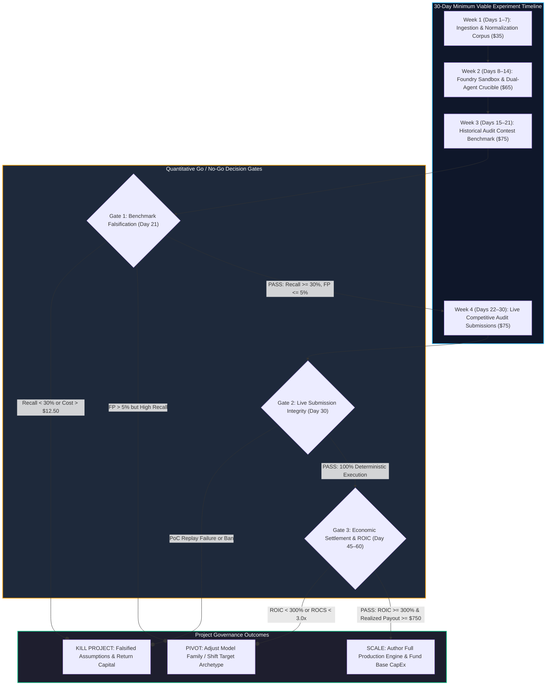
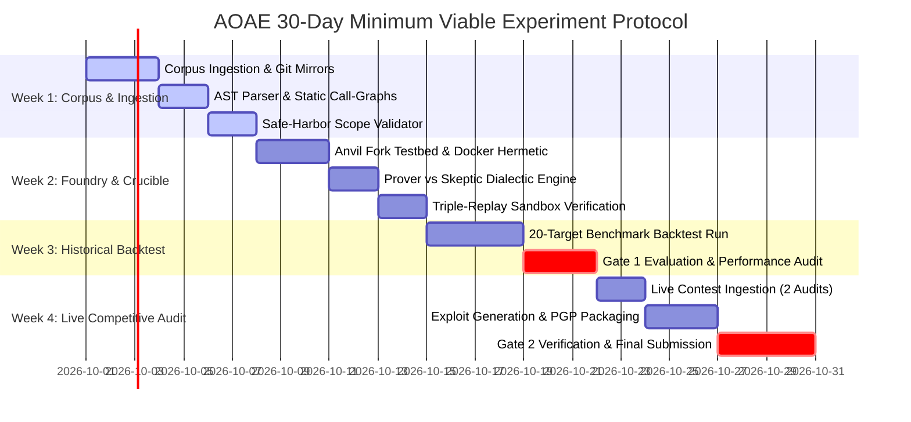
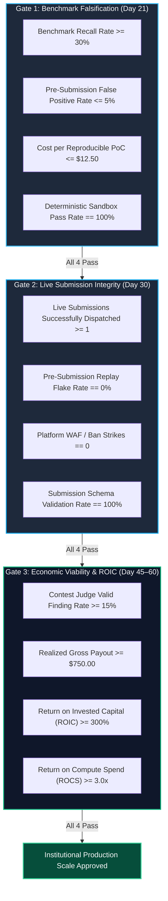
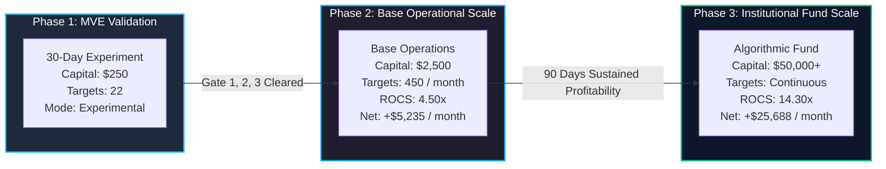

# Minimum Viable Experiment (MVE) Blueprint & Quantitative Decision Gates

## 1. Executive Summary & The Empirical Validation Philosophy

The **Autonomous Opportunity Arbitrage Engine (AOAE)** represents an institutional-grade financial and architectural thesis: that autonomous cognitive agents, bounded by deterministic local sandboxes and governed by quantitative capital allocation, can sustainably harvest programmatic standing rewards.

However, institutional discipline mandates that capital is never committed at scale to unverified theoretical models. Before investing $11,000 in dedicated workstation hardware, deploying thousands of dollars in monthly cloud infrastructure, or writing 50,000 lines of scaling software, we execute a rigorous **30-Day, $250-Budget Minimum Viable Experiment (MVE)**.

The primary objective of the MVE is not to validate commercial optimism, but to conduct an aggressive empirical falsification of the engine's four core axioms:

1. **Deterministic Equivalence Axiom**: That local state machine execution on ephemeral testnet forks matches live network behavior ($\delta_{\text{local}} \equiv \delta_{\text{mainnet}}$), eliminating human triage dispute friction.
2. **Cost-per-Proof Feasibility Axiom**: That frontier LLM reasoning, bounded by AST compaction, can synthesize valid, non-trivial smart contract exploit PoCs at a marginal compute cost $\le \$12.50$ per reproducible finding.
3. **Adversarial Pre-Filtering Axiom**: That the dual-agent Hypothesis Prover vs Adversarial Skeptic dialectic achieves a pre-submission false-positive escape rate $\le 5\%$, preserving platform standing and hunter reputation.
4. **Economic Viability Axiom**: That competitive audit contest submissions yield realized payouts producing a Return on Invested Capital ($\text{ROIC}$) $\ge 300\%$ over marginal execution expenses.

---

## 2. The $250 Budget Allocation & Unit Economics

The $250 total budget represents a hard capital ceiling. The experiment is designed to operate entirely within this constraint, utilizing open-source developer tooling, free tier platform allowances, and metered API token credits.

### 2.1 Capital Allocation Schedule

| Budget Category | Provider / Service Item | Unit Basis & Consumption Rate | Allocated Budget (USD) | Cumulative Share (%) |
|---|---|---|---|---|
| **LLM Inference: Frontier Reasoning** | Anthropic Claude 3.5 Sonnet / OpenAI GPT-4o | Prompt: $3.00/MTok, Completion: $15.00/MTok (~15M input / ~3.5M output tokens) | $150.00 | 60.0% |
| **LLM Inference: Fast Local Processing** | Self-hosted Qwen 2.5 Coder 32B / Ollama | Local consumer hardware inference for AST parsing and initial AST summaries | $10.00 | 4.0% |
| **Cloud Compute & Sandboxing** | Hetzner Cloud CX22 / Local Workstation Runner | Ephemeral container execution, EVM compilation, and local Anvil state forks | $35.00 | 14.0% |
| **Blockchain RPC Node Credits** | Alchemy / QuickNode Developer Tier | Archive state lookups, historical storage slots, and state trie sync | $30.00 | 12.0% |
| **Proxy Egress & Network Camouflage** | Bright Data Residential Proxy Starter | Anti-fingerprinting proxy traffic for public repository ingestion | $15.00 | 6.0% |
| **Compliance & Operations Buffer** | Platform identity escrow and domain relay | Identity verification checks and contingency token buffer | $10.00 | 4.0% |
| **Total Experiment Budget** | **Strict Hard Cap Commitment** | **Comprehensive 30-Day Validation Run** | **$250.00** | **100.0%** |

### 2.2 Target Unit Cost Constraints

To satisfy the $250 total budget across 20 benchmark targets and 2 live contest targets, marginal costs must adhere to the following upper bounds:

- **Target Ingestion & AST Static Scan**: $\le \$0.45$ per target (Fast static analysis using Slither/Semgrep + local SLM).
- **Adversarial Invariant Reasoning (Prover)**: $\le \$5.50$ per candidate vulnerability (Frontier LLM AST reasoning).
- **Adversarial Falsification Challenge (Skeptic)**: $\le \$3.50$ per challenge evaluation (Constrained red-team prompt).
- **Deterministic Replay & Proof Synthesis (Sandbox)**: $\le \$1.50$ per container execution run.
- **Maximum Marginal Cost per Reproducible Finding**: $\le \mathbf{\$12.50}$ total compute and token spend.

---

## 3. Week-by-Week Implementation Protocol

The 30-day experiment is executed across four sequential phases, each designed to validate a specific operational layer.

### 3.1 Week 1 (Days 1–7): Corpus Assembly, AST Normalization & Legal Ingestion

- **Primary Objective**: Establish the target data pipeline without executing live scans or incurring high token costs.
- **Protocol Steps**:
  1. *Corpus Assembly*: Curate 20 completed historical audit contests from Code4rena and Sherlock (spanning lending markets, automated market makers, and liquid staking protocols) with known, adjudicated findings (ground-truth dataset).
  2. *Normalization Pipeline (Subsystem 02)*: Convert disparate repository layouts, README scopes, and contest rules into Canonical Opportunity Schemas (COS).
  3. *Static Analysis & Invariant Extraction (Subsystems 07 & 09)*: Run Slither and Semgrep AST passes to generate property invariants (e.g., token balance conservation, solvency invariants, access-control graphs).
  4. *Safe-Harbor Filtering (Subsystem 03)*: Verify that legal scope boundaries, excluded contracts, and authorized attack surfaces are deterministically represented in machine-readable JSON.
- **Budget Burn**: $35.00 ($25.00 proxy/infra setup + $10.00 API schema validation).
- **Exit Deliverable**: 20 normalized benchmark target directories with pre-compiled AST graphs and verified safe-harbor rule sets.

### 3.2 Week 2 (Days 8–14): Local Foundry Sandbox & Prover/Skeptic Crucible

- **Primary Objective**: Build and verify the deterministic execution core and the dual-agent adversarial validation loop.
- **Protocol Steps**:
  1. *Hermetic Sandbox Engine (Subsystems 08 & 12)*: Implement Docker container orchestrator with `--net=none`, mounting local Anvil blockchain state forks pinning specific block numbers.
  2. *Hypothesis Prover Agent (Subsystem 10)*: Author prompt harness for exploit synthesis, enforcing unprivileged caller origins (`address(0xbad)`) and quantifiable token delta assertions.
  3. *Adversarial Skeptic Agent (Subsystem 11)*: Author hostile red-team verification persona, challenging candidate PoCs against six falsification criteria (privilege escalation, boundary checks, gas exhaustion, known design choices, slippage bounds, and scope exclusions).
  4. *Deterministic Replay Harness (Subsystem 12)*: Build the triple-execution runner ($3\times$), requiring three consecutive exit-code 0 passes with non-zero balance deltas.
- **Budget Burn**: $65.00 ($15.00 container compute + $50.00 prototype prompt engineering).
- **Exit Deliverable**: A fully functioning end-to-end local testbed capable of receiving an AST context, debating an exploit, and confirming it in a sandboxed Anvil fork.

### 3.3 Week 3 (Days 15–21): Historical Benchmark Falsification Run

- **Primary Objective**: Execute the autonomous engine against the 20 historical benchmark targets to measure true precision, recall, false-positive escape rates, and unit costs.
- **Protocol Steps**:
  1. *Autonomous Backtest Dispatch*: Feed the 20 benchmark codebases into the engine without providing access to historical findings or judge reports.
  2. *Metric Capture*: Record token consumption, execution wall-clock time, synthesized PoCs, Skeptic rejections, and Replay Sandbox passes.
  3. *Ground-Truth Adjudication*: Compare synthesized findings against the official judge report for each contest. Classify each finding as True Positive (valid High/Medium), False Positive (hallucinated or out-of-scope), or Duplicated Known Vulnerability.
  4. *Gate 1 Evaluation*: Evaluate performance metrics against the strict numerical thresholds defined in Section 4.1.
- **Budget Burn**: $75.00 ($10.00 RPC calls + $65.00 LLM token inference across 20 targets).
- **Exit Deliverable**: An audited benchmark performance scorecard and a formal Gate 1 decision record.

### 3.4 Week 4 (Days 22–30): Live Competitive Audit Submissions

- **Primary Objective**: Deploy the engine against real, active competitive audit contests with live prize pools, submitting verified PoCs to real contest judges.
- **Protocol Steps**:
  1. *Contest Selection*: Identify 2 active, newly launched competitive audit contests on Code4rena or Sherlock with standing prize pools between $30,000 and $100,000 and at least 5 days remaining before contest closure.
  2. *Live Autonomous Run*: Execute the complete autonomous pipeline: ingest repository, extract invariants, formulate hypotheses, survive Skeptic challenge, and achieve $3\times$ deterministic replay in Subsystem 12.
  3. *Advisory Synthesis (Subsystem 13)*: Compile verified vulnerabilities into standardized Markdown security advisories including executive summary, root cause, runnable Foundry test file, and patch diff.
  4. *Secure Submission (Subsystem 14)*: Dispatch encrypted submission packages via official platform rails.
  5. *Gate 2 Evaluation*: Verify submission acceptance, zero platform friction, and deterministic judge reproduction.
- **Budget Burn**: $75.00 ($60.00 frontier token inference + $15.00 RPC and infrastructure).
- **Exit Deliverable**: Live submission receipts, confirmed platform ticket IDs, and telemetry records logged in Subsystem 16.

---

## 4. Quantitative Go / No-Go Decision Gates

The project transitions through three formal, numerical decision gates. If the engine fails any metric threshold, execution halts immediately.

### 4.1 Gate 1: Benchmark Falsification Gate (End of Week 3, Day 21)

Evaluated upon completing the 20-target historical audit benchmark. Determines whether the engine possesses genuine vulnerability discovery capability.

| Evaluation Metric | Mathematical Formulation | Strict Threshold | Rationale & Failure Consequence |
|---|---|---|---|
| **Benchmark Recall Rate** | $\frac{\text{True Positives Discovered}}{\text{Total Historical High/Medium Findings}}$ | $\ge \mathbf{30.0\%}$ | If the engine uncovers fewer than 30% of known vulnerabilities, automated reasoning capability is insufficient for live competition. **FAIL $\to$ HALT**. |
| **Pre-Submission False Positive Escape Rate** | $\frac{\text{Hallucinated Candidates Passing S12}}{\text{Total Candidates Sent to S12}}$ | $\le \mathbf{5.0\%}$ | If more than 5% of candidate exploits reaching final replay are invalid, the Skeptic agent is failing. **FAIL $\to$ RE-TUNE PROMPTS**. |
| **Cost per Reproducible PoC** | $\frac{\text{Total Token + Compute Spend}}{\text{Total Verified Exploit Tests}}$ | $\le \mathbf{\$12.50}$ | If unit cost exceeds $12.50, unit economics will degrade into negative EV at current market duplicate rates. **FAIL $\to$ HALT**. |
| **Sandbox Determinism Rate** | $\frac{\text{Runs with Identical State Delta}}{\text{Total Replay Runs Executed}}$ | $\mathbf{\equiv 100.0\%}$ | Zero tolerance for test flakiness. All verified PoCs must produce identical state deltas across $3\times$ execution. **FAIL $\to$ ISOLATE RUNTIME**. |

- **Decision Rules**:
  - **FULL PASS**: All 4 metrics satisfied $\to$ Release remaining $75.00 budget and proceed to Week 4 Live Submissions.
  - **CONDITIONAL PASS**: Recall $\ge 25\%$ and Cost $\le \$12.50$, but False Positive Rate between 5% and 10% $\to$ 48-hour prompt recalibration of Subsystem 11 Skeptic before proceeding.
  - **HARD FAIL**: Recall $< 25\%$ OR Cost $> \$12.50 \to$ Terminate experiment immediately; archive research logs; return unspent capital.

### 4.2 Gate 2: Live Submission Integrity Gate (End of Week 4, Day 30)

Evaluated upon submitting candidate vulnerabilities to active competitive audit contests.

| Evaluation Metric | Mathematical Formulation | Strict Threshold | Rationale & Failure Consequence |
|---|---|---|---|
| **Verified Live Submissions** | Total unique findings submitted | $\ge \mathbf{1 \text{ finding}}$ | Must produce at least one fully verified, deterministic PoC on active live protocols. **FAIL $\to$ EXTEND RUN 3 DAYS**. |
| **Judge Reproduction Fidelity** | Exit code of submitted PoC in judge sandbox | $\mathbf{\equiv 0 \text{ (100% Pass)}}$ | Submitted Foundry tests must execute cleanly in contest judging environments with zero external dependencies. **FAIL $\to$ HALT**. |
| **Platform Anti-Abuse Integrity** | Account disciplinary strikes / IP blocks | $\mathbf{0 \text{ strikes}}$ | Demonstrates that residential proxy rotation and behavioral jitter completely bypass sybil filters. **FAIL $\to$ ROTATE INFRA**. |
| **Attestation & Safe-Harbor Check** | Cryptographic compliance audit digest | $\mathbf{\equiv \text{VALID}}$ | Guarantees that submitted contracts were within contest scope and met legal safe-harbor rules. **FAIL $\to$ DISQUALIFY TARGET**. |

- **Decision Rules**:
  - **FULL PASS**: Submissions delivered, zero platform flags, clean replay logs $\to$ Enter Triage & Settlement Phase (Days 30–60).
  - **HARD FAIL**: Disciplinary strike from platform OR failure of PoC to compile on judge runner $\to$ Immediate operational halt and root-cause analysis.

### 4.3 Gate 3: Economic Viability & ROIC Hurdle Gate (Settlement, Days 45–60)

Evaluated after contest judging concludes and financial payouts are settled into the operator's wallet.

| Evaluation Metric | Mathematical Formulation | Strict Threshold | Rationale & Failure Consequence |
|---|---|---|---|
| **Contest Judge Acceptance Rate** | $\frac{\text{Accepted High/Medium Submissions}}{\text{Total Submissions Dispatched}}$ | $\ge \mathbf{15.0\%}$ | Validates that autonomous findings meet human judge standards of severity and validity. **FAIL $\to$ PIVOT TARGET CLASS**. |
| **Realized Gross Payout** | Total settled bounty rewards in USDC | $\ge \mathbf{\$750.00}$ | Empirical confirmation of financial yield from live protocol treasuries. **FAIL $\to$ EVALUATE MARGINAL EV**. |
| **Return on Invested Capital (ROIC)** | $\frac{\text{Gross Revenue} - \text{Total Incurred Cost}}{\text{Total Capital Incurred}}$ | $\ge \mathbf{300.0\%}$ | Proves that autonomous operations compound capital at institutional hurdle rates ($\ge 3.0\times$ net return). **FAIL $\to$ HALT**. |
| **Return on Compute Spend (ROCS)** | $\frac{\text{Gross Revenue}}{\text{Compute \& Token Spend}}$ | $\ge \mathbf{3.00\times}$ | Validates that every dollar expended on silicon and tokens generates at least $3.00 in cash return. **FAIL $\to$ REFINE ALLOCATOR**. |

- **Decision Rules**:
  - **GO (Institutional Scale)**: All Gate 3 thresholds achieved $\to$ Authorize deployment of Milestone 4 full capital schedule ($2,500 Base Mode; $11,000 CapEx).
  - **NO-GO (Project Kill)**: Realized payout $< \$250.00$ or ROIC $< 0\% \to$ Conclude that competitive crowding and LLM reasoning limits make autonomous competition unprofitable; terminate project permanently.

---

## 5. Detailed Pivot & Kill Criteria

To eliminate sunk-cost bias and emotional decision-making, the following table prescribes mandatory responses to failure scenarios encountered during the MVE.

| Failure Symptom | Underlying Root Cause | Mandatory Strategic Response | Recovery Horizon |
|---|---|---|---|
| **Benchmark Recall $< 20\%$** | Current frontier models lack sufficient symbolic reasoning to extract multi-contract state invariants. | **PERMANENT KILL**: Terminate project. Current LLM capabilities cannot sustain autonomous exploit synthesis. | Immediate |
| **False Positive Rate $> 20\%$ in Sandbox** | Prover hallucinating non-existent state paths; Skeptic failing to detect boundary checks. | **PIVOT**: Switch Prover from Claude 3.5 Sonnet to OpenAI o1 / o3 reasoning models; increase Skeptic prompt temperature to 0.4. | 5 Days |
| **Cost per PoC $> \$25.00$** | Context Compactor allowing excessive AST dumps into prompts; unconstrained recursive repair loops. | **ARCHITECTURAL PIVOT**: Enforce hard token budget ceiling of 1,500 tokens in Subsystem 09; cap repair attempts at 2. | 3 Days |
| **Zero Live Payouts due to Duplicate Density** | Target contests over-crowded by hundreds of human hunters submitting identical common findings. | **STRATEGIC PIVOT**: Restrict future scope to newly deployed standing Immunefi bug bounties or complex multi-chain bridges with low hunter density. | 7 Days |
| **Platform Ban or CAPTCHA Block** | Ingress or egress traffic flagged by Cloudflare Bot Management or JA4 fingerprinting. | **INFRASTRUCTURE PIVOT**: Switch from data-center egress to residential 4G/5G mobile proxy pools; implement manual MFA webhook. | 2 Days |

---

## 6. Institutional Scale Transition Roadmap (Post-Gate 3)

Upon achieving 100% compliance across Gates 1, 2, and 3, the engine transitions from experimental status to institutional capital management.

### 6.1 Transition Milestones

1. **Working Capital Injection**: Fund the primary treasury reserve with $2,500.00 in liquid USDC, guaranteeing gambler's ruin immunity ($P_{\text{ruin}} \le 0.2\%$).
2. **CapEx Deployment**: Procure the research workstation ($6,200 AMD Threadripper + dual NVMe + RTX 4090) and hardware security enclaves ($1,250 Ledger/YubiKey) to eliminate local compute bottlenecks.
3. **Fractional Kelly Capital Governance**: Automate dynamic compute allocation using the Quarter-Kelly ($0.25 f^*$) allocation model:
   - Audit Contests: 65% of daily budget.
   - Standing Criticals: 35% of daily budget.
   - Web2 Bounties: 0% (Hard Veto).

For detailed capital allocation geometry and financial projections, refer to the accompanying quantitative assets:
- Fractional Kelly Model: [assets/kelly_allocation.svg](../assets/kelly_allocation.svg)
- Multi-Horizon Trajectories: [assets/financial_trajectories.svg](../assets/financial_trajectories.svg)
- Web3 vs Web2 Expected Value: [assets/ev_comparison.svg](../assets/ev_comparison.svg)

---

## 7. Conclusion: The Power of Scientific Falsification

The Minimum Viable Experiment is structured to protect capital above all else. By subjecting the Autonomous Opportunity Arbitrage Engine to rigorous quantitative gates with immutable numerical criteria, we ensure that scaling capital is deployed only behind verified, empirical truth.

If the thesis holds, the MVE produces the exact operational evidence required to scale into an institutional algorithmic arbitrage venture. If the thesis fails, the experiment terminates cleanly with a maximum capital loss strictly bounded at $250.00.
